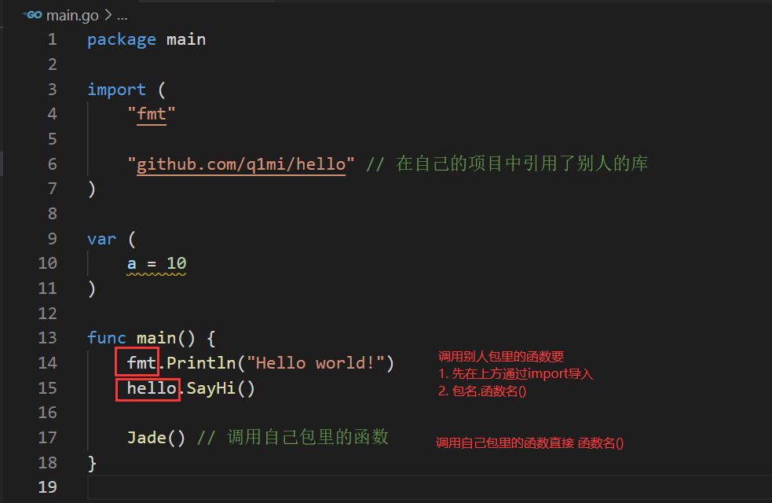

# day02课上代码和笔记


## 内容回顾

1. Go语言的开发环境搭建
   1. 装go的时候安装到一个你能找到的目录
   2. go env
   3. VsCode的安装及注意事项
      1. 设置GOPROXY
      2. 一个VsCode、Goland窗口打开一个Go项目
2. 变量
   1. 变量的概念
   2. 匿名变量: _
   3. go语言推荐驼峰命名
3. 常量
   1. iota 
4. 基本数据类型
   1. 字符串
   2. 整数、浮点数、复数
   3. 布尔值
   4. 字符（单引号包裹）
   5. byte、rune
5. 运算符
6. 流程控制语句
   1. if else
   2. for
   3. switch case
   4. goto/continue/break/return
7. Go语法注意事项
   1. 变量声明之后必须使用（非全局）
   2. go源码文件中必须以关键字开头

问题：

1. `go.mod`

   1. 保存项目的依赖信息
      1. go的版本
      2. 依赖包的名称和版本

2. package

   1. 一个可执行程序必须要有一个main包和main函数

3. go build和go run

   1. `go run`:在一个临时目录先编译再执行
   2. `go build`：编译程序
   3. 
   4. 一个项目下有多个源码文件时
   
1. 
  
5. 编译时指定可执行文件的名称
  
      1. `go build -o xxx.exe`(Windows)
   2. `go build -o xxx`(Mac)
   
6. 交叉编译
  
   1. 编译的时候是一个环境，执行程序的是另一个环境，例如：我在Windows下面写代码，然后编译一个在Linux环境执行的程序
   
   2. 
   
      ​		https://www.liwenzhou.com/posts/Go/install_go_dev/#autoid-1-5-1
   
         

**有问题一定一定要问！不要害羞，学习是自己的。**


## 今日内容

基础数据类型 、 复合数据类型

### 数组

https://www.liwenzhou.com/posts/Go/05_array/

#### 数组的声明

```go
var a [3]int64
var b [2]bool
var c [10]string
```

**注意事项**

1. 数组的长度必须是常量，并且长度是数组类型的一部分.

2. 数组支持索引访问 `a[1]` 、`c[7]`，索引的合法范围：`0`~`len(array)-1`，**不支持负数索引**。


#### 数组初始化

```go
var x = [3]int{1, 2, 3}
var y = [...]bool{true, false, true}   // ... 表示让编译器自行推断数组长度
var z = [100]int{99:1}             // 索引位置99的值为1
var zz = [...]int{99:1}
var cityArray = [3]string{"北京", "上海", "深圳"} //使用指定的初始值完成初始化
```

#### 数组的遍历


```go
var a = [...]string{"北京","上海","深圳"}
// for i 索引遍历
for i :=0; i < len(a);i++{
  fmt.Println(a[i])
}
// for range 遍历
for index,value := range a{
  fmt.Println(index.value)
}

for _,v := range a{
  fmt.Println(v)
}


```


#### 多维数据

这里以二维数组为例，三维数组、四维数组类似。

二维数组的定义

```go
var xx = [3][2]string{
		{"北京", "石家庄"},
		{"上海", "苏州"},
		{"成都", "重庆"}, // 注意：最外层的花括号换行则这里必须加,
	}
```


二维数组的遍历

索引遍历

```go
for i := 0; i < len(xx); i++ {
		tmp := xx[i]
		// 第一层
		fmt.Printf("xx[%v]:%v\n", i, xx[i])
		// 第二层
		for j := 0; j < len(tmp); j++ {
			fmt.Printf("\t xx[%v][%v]:%v\n", i, j, tmp[j])
		}
	}
```


for range遍历

```go
for i1, v1 := range xx {
		fmt.Printf("xx[%v]: %v\n", i1, v1)
		// 第二层
		for i2, v2 := range v1 {
			fmt.Printf("\txx[%v][%v]:%v\n", i1, i2, v2)
		}
	}
```


#### 数组是值类型

**赋值、函数传参都是拷贝，修改副本不影响原值。**

```go
func modifyArray(x [3]int) {
	x[0] = 100
}

func modifyArray2(x [3][2]int) {
	x[2][0] = 100
}
func main() {
	a := [3]int{10, 20, 30}
	modifyArray(a) //在modify中修改的是a的副本x
	fmt.Println(a) //[10 20 30]
	b := [3][2]int{
		{1, 1},
		{1, 1},
		{1, 1},
	}
	modifyArray2(b) //在modify中修改的是b的副本x
	fmt.Println(b)  //[[1 1] [1 1] [1 1]]
}

```


**Go语言中全部都是值拷贝（深拷贝），Go语言是通过传递指针实现修改原来的值。**（后面讲指针细说）

#### 课后练习

1 求数组[1,3,5,7,8]所有元素的和

2 找出数组中和为指定值的两个元素的下标，比如从数组[1，3，5，7，8]中找出和为8的两个元素的下标分别为(1,3)和(1,2)

```go
// 练习1:求数组元素的和
func arraySum() {
	var a = [...]int{1, 3, 5, 7, 8, 10}
	sum := 0
	for _, value := range a {
		sum = sum + value
		// sum += value  // 简写
	}

	fmt.Println(sum)
}

// 练习2：求数组中元素和为8的元素的下标(索引)
// 1 + 7 = 8;索引(0,3)
// 3 + 5 = 8;索引(1,2)
// 1.拿到数组中的每一个元素 ：遍历数组
// 2.找到元素和为8的那两个元素 ： 数学运算和比较运算
// 3.把符合要求的索引打印出来  ： fmt.Println()
func arraySum2() {
	var a = [...]int{1, 3, 5, 7, 8, 10}

	// 正向思路
	for i := 0; i < len(a); i++ {
		for j := i + 1; j < len(a); j++ {
			if a[i]+a[j] == 8 {
				// 找到啦
				fmt.Println(i, j)
			}
		}
	}

	// 反向思路
	for i, v := range a {
		x := 8 - v // 要找的目标值
		for j := i + 1; j < len(a); j++ {
			if a[j] == x {
				fmt.Println(i, j)
			}
		}
	}
}
```


### 切片

https://www.liwenzhou.com/posts/Go/06_slice/

#### 切片声明

```go
var s []int  // nil
```

#### 切片的原理

大力出奇迹教育公司的例子


#### 切片表达式

切片表达式中的数字都是指的 **索引** ！！！

##### 切片简短表达式

对字符串和数组：`0 <= low < high <= len`

对切片：`0 <= low < high <= cap`

##### 切片完整表达式

```go
func slice3() {
	// 默认切片的容量是从切片的开始索引到数组的最后
	// max: 影响切片的容量
	// max:想象成high能取到的最大值
	// 最终切片的容量：max-low
	a := []int{1, 2, 3, 4, 5}
	// a[low:high:max]
	s1 := a[1:2:3]                    // 0 <= low <= high <= max <= cap(a)
	fmt.Println(s1, len(s1), cap(s1)) // [2] 2 2
}
```

#### 字面量初始化

```go
// 字面量初始化(花括号)
func slice4() {
	s1 := []int{1, 2, 3}
	fmt.Println(s1)  // [1 2 3]
	s2 := []int{99: 1}
	fmt.Println(s2)
}
```

#### make初始化切片

切片声明之后需要使用内置的make函数做初始化！

```go
// 使用make函数初始化
	// make([]T, len, cap) cap可以省略,cap=len
	// s = make([]int, 2) // len = cap = 2
	// s = make([]int, 2, 4) // len = cap = 2
	s = make([]int, 2, 4)          // len =2, cap = 4
	fmt.Println(s, len(s), cap(s)) // [0 0] 2 4
	fmt.Println(s == nil)          // false

	s1 := make([]int, 0)
	fmt.Println(s1 == nil) // false

	s2 := make([]int, 0, 15)          // 一次把内存申请到位
	fmt.Println(s2, len(s2), cap(s2)) // ?

	// 如果你确定一个切片中最终要存储的元素个数，那么你最好一次把内存申请到位
```

#### 切片的赋值拷贝

```go
func main() {
	s1 := make([]int, 3) //[0 0 0]
	s2 := s1             //将s1直接赋值给s2，s1和s2共用一个底层数组
	s2[0] = 100
	fmt.Println(s1) //[100 0 0]
	fmt.Println(s2) //[100 0 0]
}
```


#### 切片的复制

使用内置的copy函数完成复制

```go
func copyDemo2() {
	a := []int{1, 2, 3}
	// var b = make([]int, 0, len(a))
	b := make([]int, len(a)) // 直接按目标切片的长度进行初始化
	copy(b, a)               // 把切片a中的值拷贝到切片b中
	fmt.Println(b)           // ?
	b[1] = 200

	fmt.Println(a) // ?
	fmt.Println(b) // [1 200 3]
}
```

使用copy函数要注意，事先初始化好切片的长度

```go
func copyDemo() {
	a := []int{1, 2, 3}
	// var b = make([]int, 0, len(a))
	b := make([]int, 0)
	copy(b, a)     // 把切片a中的值拷贝到切片b中
	fmt.Println(b) // [] ? 为什么？
}
```


#### append函数

**使用append函数时必须接收返回值！！！**

```go
func appendDemo() {
	var s = []string{"北京"}
	// apend函数可能触发切片的扩容
	// 切片扩容之后会有一个新的底层数组，需要更新变量s
	s = append(s, "上海")
	fmt.Println(s) // [北京 上海]

	s2 := []string{"广州", "深圳"}
	s = append(s, s2...) // ...表示将s2拆开一个一个元素追加
	fmt.Println(s)       // [北京 上海 广州 深圳]

	// 零值切片可以直接在append中使用
	var s3 []int // nil
	fmt.Println(s3 == nil)
	s3 = append(s3, 1)
	s3 = append(s3, 2, 3, 4)
	fmt.Println(s3)
}
```


##### append触发扩容

```go
// appendDemo2 使用append函数触发扩容
// 导致意想不到的事情发生
func appendDemo2() {
	var s = []string{"北京"}
	_ = append(s, "上海", "广州", "深圳")
	fmt.Println(s) // [北京]
}

// appendDemo3 append函数导致切片扩容示例
func appendDemo3() {
	var s = []string{"北京"}
	fmt.Println(len(s), cap(s)) // len = cap = 1
	s = append(s, "上海", "广州", "深圳")
	fmt.Println(len(s), cap(s)) // 4 4
	fmt.Println(s)              // [北京]
}
```

#### 删除切片的元素

```go
// deleteSlice 删除切片中的元素
func deleteSlice(idx int) {
	idx = 1
	var s = []int{1, 2, 3}
	s = append(s[:idx], s[idx+1:]...)
	fmt.Println(s)  // [1 3]
}
```


#### 切片操作技巧（补充）

https://www.liwenzhou.com/posts/Go/slice_tricks/


### map


#### map函数的原理 

map是key-value结构的数据类型，类似于其他语言中的hash table,dict等

key必须是可hash的值，是一个确定的值（key的值不能设置了之后又发生了改变）

map存储的时候 hash(key) --> 固定的值  --> 把value放到对应的位置保存

map[key]  : hash(key) --> 得到值 --> 取对应的value


#### map初始化

```go
func mapDemo1() {
	var m map[string]int

	fmt.Println(m == nil)    // true
	m = make(map[string]int) // 只要初始化就可以赋值
	fmt.Println(m == nil)    // false

	m["jade"] = 300 // 设置值
	fmt.Println(m)
	weight := m["jade"] // 取值
	fmt.Println(weight)

	// 字面量初始化
	m2 := map[string]string{
		"username": "七米",
		"password": "1234", // 花括号换行则此处必须加逗号
	}
	fmt.Printf("%#v\n", m2)

	name := m2["name"]
	fmt.Println(name)
	// v, ok 取值  ; ok是一个变量名，只不过大家约定成俗在这里用ok
	// ok = true表示map中有这个key， ok=false表示map没有这个key
	// 如果没有这个key，此时v=对应类型的零值
	v, ok := m2["name"] // 类似与for range 可以用一个变量也可以两个变量接收
	fmt.Println(v, ok)

	_, ok = m2["name"]
	fmt.Println(ok)
}
```

#### 遍历

```go
// map的遍历（map是无序的）
func mapDemo2() {
	m := map[string]int{
		"jade": 300,
		"ddd":  180,
		"嚯嚯嚯":  160,
	}

	for k, v := range m {
		fmt.Println(k, v)
	}

	// 只取map中的key
	for k := range m {
		fmt.Println(k)
	}

	// 只取map中的value
	for _, v := range m {
		fmt.Println(v)
	}

}
```

#### 从map中删除键值对

```go
// 从map中删除键值对
delete(m, "jade") // 没有返回值
fmt.Println(m)
```


#### 判断key是否存在

```go
// 判断map中是否存在某个key
_, ok := m["小盆子"]
fmt.Println(ok)
```

#### map+slice 组成复杂一点的数据类型

```go
// 元素类型是map的切片
func sliceMapDemo1() {
	// []int []string []map[string]int  切片的元素是map  3是切片长度
	var mapSlice = make([]map[string]string, 3)

	for index, value := range mapSlice {
		fmt.Printf("index:%d value:%v\n", index, value)
	}
	fmt.Println("after init")
	// 对切片中的map元素进行初始化
	mapSlice[0] = make(map[string]string, 10)
	mapSlice[0]["name"] = "小王子"
	mapSlice[0]["password"] = "123456"
	mapSlice[0]["address"] = "沙河"
	for index, value := range mapSlice {
		fmt.Printf("index:%d value:%v\n", index, value)
	}
}

func mapSliceDemo2() {
	// map[string]int  map[string][]int
	var sliceMap = make(map[string][]string, 3)

	fmt.Println(sliceMap)
	fmt.Println("after init")
	key := "中国"
	value, ok := sliceMap[key]
	if !ok {
		value = make([]string, 0, 2)
	}
	value = append(value, "北京", "上海")
	sliceMap[key] = value
	fmt.Println(sliceMap)
}
```


## 课后作业

1. 把课上的代码自己敲一遍

2. 下面两个题。

   

1. 写一个程序，统计一个字符串中每个单词出现的次数。比如：”how do you do”中how=1 do=2 you=1。

```go
// 写一个程序，统计一个字符串中每个单词出现的次数。
	// 比如：”how do you do”中how=1 do=2 you=1。
	s := "how do you do"

	// 1.用map存数据，key是单词，value是单词出现的次数
	// 2.将字符串分成一个一个的单词
	// 3.把上一步得到的单词挨个存放到map里
	// 4.遍历map打印结果

	// 迎刃而解
	var m map[string]int
	m = make(map[string]int)
	s1 := strings.Split(s, " ") // 切片
	for _, v := range s1 {
		// m[v] = 1  // m["do"] = 1
		num := m[v]
		m[v] = num + 1

		// m[v]++

		// if ok{
		// 	m[v] = num+1
		// }else{
		// 	m[v] = 0+1
		// }
	}

	for k, v := range m {
		fmt.Println(k, v)
	}
```

1. 观察下面代码，写出最终的打印结果。

```go
func main() {
	type Map map[string][]int
	m := make(Map)
	s := []int{1, 2}
	s = append(s, 3)
	fmt.Printf("%+v\n", s) //[1 2 3]
	m["q1mi"] = s
	s = append(s[:1], s[2:]...)
	fmt.Printf("%+v\n", s)         // [1 3]
	fmt.Printf("%+v\n", m["q1mi"]) // [1 3 3 ] 底层共用一个内存地址
}
```


