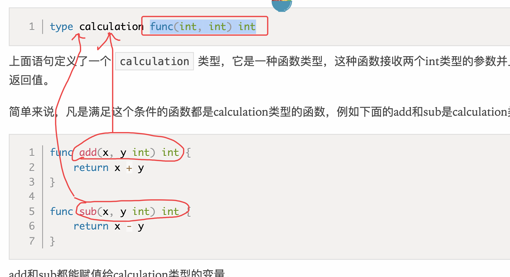
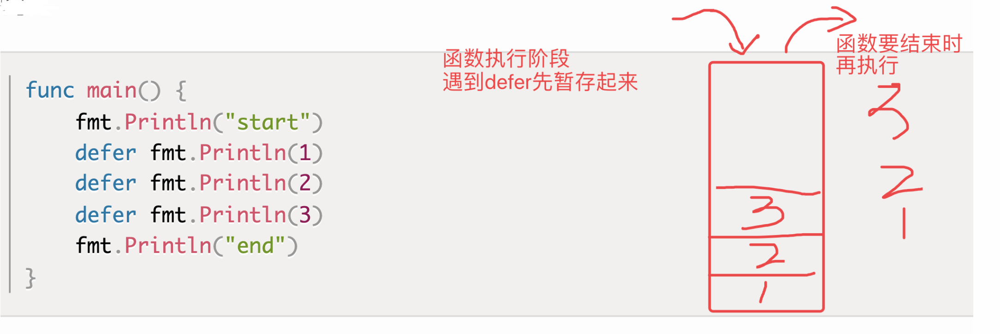

# day03课上笔记


## 内容回顾

复合数据类型  --想到--> 基础数据类型（字符串、整型、浮点型、布尔型）

**学习路线**

什么是（定义） -> 使用 --> 注意事项

### 数组

数组  [3]int、[5]string、[...]bool

```go
var array1 [3]int  // [0 0 0]
var array2 = [3]int{1, 2, 3}
```

默认值 --> 对应类型的零值

- [3]string  --> ""（fmt.Println()`[]`）  -->  `fmt.Printf("%#v", v)` `[""]`
- [100]int32

长度固定的

不怎么常用

数据的遍历

- 索引(下标)

- for range

- ### 切片

切片:[]int、[]string、[]bool

- 切片是一个Go语言基于数组封装的类型，它底层是一个数组。
- 大力出奇迹教育公司的例子

```go
var slice1 []int  // nil
var slice []int{1, 2, 3}
```

- 切片表达式（得到一个切片的方法）

  - 简短切片表达式 `s[low:high]`

  - 完整切片表达式 `s[low:high:max]`

- make初始化

- 切片的空值是nil

- 扩容策略

- 遍历切片

- copy
  - 由切片x得到切片y（直接赋值y = x、切片再切片y = x[:]），不想修改原来的切片
  - copy(dst, src)  // 返回拷贝成功的元素数量
  - 复制之前一定要把dst切片，准备好空间（len）make([]int, 10)
- 不支持负数索引， 取最后一个元素要写：s[len(s)-1]
- append函数
  - 向切片中追加元素
  - **必须接收值**  --> 可能会触发切片的扩容 --> 保证切片正常需要再次赋值   slice1 = append(slice1, 1)

```go
var slice3 []int
slice3 = make([]int, 0, 1000000)
slice3 = append(slice3, 1)
slice3 = append(slice3, 1, 1, 1)
```

- 切片中删除元素, 目前没有内置方法，可以自己用append实现

### map

键值对类型的数据，（类似于其他语言中的hash map 、dict等等）

key-value

map: map[string]int

- 增删改查

```go
var map1 map[string]int  // map初始化之后才能用
map1 = make(map1, 8)
map1["jade"] = 300  // 存值
v := map1["ddd"]  // 取值
v，ok := map1["ddd"] // 取值
_，ok := map1["ddd"] // 判断key存不存在于map中
delete(map1, "ddd")
```

- 遍历


### 课后作业

```go
func ex1() {
	// 写一个程序，统计一个字符串中每个单词出现的次数。
	// 比如：”how do you do”中how=1 do=2 you=1。
	s := "how do you do"

	// 1.用map存数据，key是单词，value是单词出现的次数
	// 2.将字符串分成一个一个的单词
	// 3.把上一步得到的单词挨个存放到map里
	// 4.遍历map打印结果

	// 迎刃而解
	var m map[string]int
	m = make(map[string]int)
	s1 := strings.Split(s, " ") // 切片
	for _, v := range s1 {
		// m[v] = 1  // m["do"] = 1
		num := m[v]
		m[v] = num + 1

		// m[v]++

		// if ok{
		// 	m[v] = num+1
		// }else{
		// 	m[v] = 0+1
		// }
	}

	for k, v := range m {
		fmt.Println(k, v)
	}
}
```

```go
func ex2() {
	// 对数组var a = [...]int{3, 7, 8, 9, 1}进行排序
	var a = [...]int{3, 7, 8, 9, 1}
	s := a[:]
	fmt.Println("before sort:", s)
	// 按什么规则对s排序
	sort.Slice(s, func(i, j int) bool {
		return s[i] < s[j]
	})
	fmt.Println("after sort:", s)
}
```

```go
func ex3() {
	m := make(map[string][]int) // 声明并初始化了一个map变量m
	s := []int{1, 2}            // 声明一个切片变量s
	s = append(s, 3)            // 向s追加一个元素
	fmt.Printf("%+v\n", s)      // [1 2 3]

	m["q1mi"] = s
	s3 := s

	// 用append从切片删除索引为1的元素 append(s[:idx], s[idx+1]...)
	s = append(s[:1], s[2:]...) // ...表示拆开切片 s = append(s[:1], 3)  [1 3]  s[1] = 3
	// s[:1]     [1]
	// s[2:]...  3
	s[1] = 100  // 修改了底层数组

	fmt.Printf("s:%+v\n", s) // [1 3]

	fmt.Printf(`m["q1mi"]:%+v`+"\n", m["q1mi"]) // [1 3 3]
	fmt.Printf("s3:%+v\n", s3)                  // [1 3 3]

	fmt.Println(len(s), len(m["q1mi"]))
}
```


## 今日内容

###函数

https://www.liwenzhou.com/posts/Go/09_function/

#### 函数的基本定义

```go
func f(x int, y string)(string, bool){
  
}
```

#### 函数的参数

- 参数的类型简写

- 不定长参数
- **没有默认参数**

#### 函数返回值

多个返回值

命名返回值

### 函数进阶

变量的作用域

1. 全局变量
2. 局部变量
   1. 函数内定义的变量
   2. 语句块定义的变量
      1. 


只要以`type`关键字开头的都是定义类型。




```go
type calculation func(int, int) int

func add(x, y int) int {
	return x + y
}

func sub(a, b int) int {
	return a - b
}

func f15() {
	var x calculation
	fmt.Printf("%T\n", x) // main.calculation
	fmt.Println(x == nil) // true
	x = add               // 把add赋值给x
	res := x(10, 20)      // ???
	fmt.Println(res)

	add(10, 20)
}
```


**函数签名**

- 函数签名 --> 函数定义（声明）的格式，与参数名称和返回值名称无关

- 函数签名一样 --> 函数的参数、返回值的类型和个数、顺序都要一样

```go
func fi(name string, age int) {}

func fj(age int, name string) {}

type MyFF func(string, int)

func f16() {
	var mf MyFF
	mf = fi
	// mf = fj  // 函数签名不一致
	mf("ddd", 1)
}
```


#### 高阶函数

```go
// 函数作为参数
func f17(x, y int, op calculation) int {
	res := op(x, y)

	return res
}

// 命名返回值
// 1.函数内部声明了一个变量res
// 2.返回值是res
func f18(x, y int, s string) (res func(int, int) int) {
	switch s {
	case "+":
		return add
	case "-":
		return sub
	}
	return  // 默认就把res返回
}

func f19(x, y int, s string) func(int, int) int {
	var res func(int, int) int // res = nil
	switch s {
	case "+":
		return add
	case "-":
		return sub
	}
	return res
}
```


#### 匿名函数和立即执行函数

```go
// 匿名函数

// 把匿名函数赋值给变量
func f33() func() {
	f1 := func() {
		fmt.Println("美好的周末就要结束啦~")
	}
	// var f2 func() = func() {
	// 	fmt.Println("美好的周末就要结束啦~")
	// }
	return f1
}

// 匿名函数立即执行
func f34() {
	func() {
		fmt.Println("美好的周末就要结束啦~")
	}()
}
```

#### 闭包

```go
// 闭包

func adder() func() int {
	var x int

	// 函数内部使用了它外部函数的变量x
	f := func() int {
		x++
		return x
	}

	// 把匿名函数当成返回值返回了
	return f
}

func adder2() func(int) int {
	var x int
	f := func(y int) int {
		x += y // x = x+y
		return x
	}
	return f
}

// 定义一个累加器
// x的值会被返回的函数一直占用着
func adder3(x int) func(int) int {
	f := func(y int) int {
		x += y // x = x+y
		return x
	}
	return f
}

func makeSuffixFunc(suffix string) func(string) string {
	return func(name string) string {
		if !strings.HasSuffix(name, suffix) {
			return name + suffix
		}
		return name
	}
}
```


#### defer

- 什么场景会用到defer
  - 释放资源
  - 关闭文件
  - 释放连接
- defer的执行顺序
  - 先注册的后执行
- defer的执行时机
  - 返回值赋值之后，底层RET指令之前
- defer语句不能接收返回值 `defer x := sub(10, 2)`



#### 内置函数

##### panic和recover

### 指针


就两个操作：

1. 取变量x的内存地址： `&x` 得到的是指针
2. 有了指针变量p，`*p` 根据内存地址去找值


#### new和make

new和make都是用来申请内存，new用的较少

区别：

1. new返回指针类型
2. make只能用于slice、map、channel


## 本周作业

1. 把课上的代码自己敲一遍
2. 

```go
/*
你有50枚金币，需要分配给以下几个人：Matthew,Sarah,Augustus,Heidi,Emilie,Peter,Giana,Adriano,Aaron,Elizabeth。
分配规则如下：
a. 名字中每包含1个'e'或'E'分1枚金币
b. 名字中每包含1个'i'或'I'分2枚金币
c. 名字中每包含1个'o'或'O'分3枚金币
d: 名字中每包含1个'u'或'U'分4枚金币
写一个程序，计算每个用户分到多少金币，以及最后剩余多少金币？
程序结构如下，请实现 ‘dispatchCoin’ 函数
*/
var (
	coins = 50
	users = []string{
		"Matthew", "Sarah", "Augustus", "Heidi", "Emilie", "Peter", "Giana", "Adriano", "Aaron", "Elizabeth",
	}
	distribution = make(map[string]int, len(users))
)

func main() {
	left := dispatchCoin()
	fmt.Println("剩下：", left)
}

```


