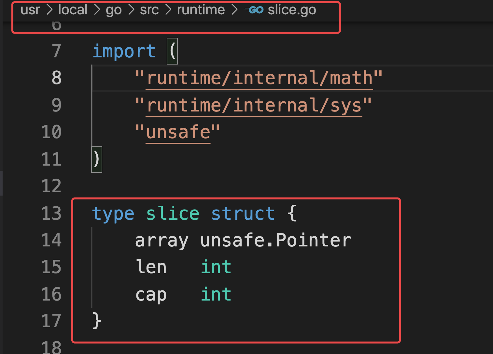

# day04课上笔记


## 内容回顾

### 函数

#### 函数基础

1. 函数的定义 

   ```go
   func f(names string, age int)(string, int){
     return 
   }
   ```

2. 函数的调用

   ```go
   f()
   ```

3. 函数的参数

   1. 0个或多个参数

   2. 多个类型相同的参数可以使用类型简写

      ```go
      // func sum(x int, y int){
      func sum(x, y int){
        
      }
      ```

   3. 可变参数（要放在最后）

      ```go
      func sum2(name string, x...int){
        // x 是[]int切片
      }
      
      
      sum2("jade")
      ```

4. 函数的返回值

   1. 普通返回值

   2. 命名返回值 相当于在函数内部声明了一个返回值变量

      ```go
      func f(x, y int)int{
        var sum int
        sum = x + y
        return sum
      }
      ```

      ```go
      func f(x, y int)(sum int){  // 在函数内部声明了一个int变量sum
        sum = x + y
        return 
      }
      ```

   3. 多个返回值

      ```go
      func op(x, y int)(sum int, sub int){
        
      }
      ```

#### 函数进阶

1. 作用域

   1. 函数内部变量和全局变量

   2. 函数内部找变量，优先找函数内部，找不到再去**上层**找

   3. 块级作用域，if 、for、switch里面定义语句块级别的变量

      ```go
      func demo1(){
        m := make(map[string]int, 8)
        if v, ok := m["jade"];ok{  // v和ok只在if块级作用域生效
          
        }
        // fmt.Println(v) 无法访问块级作用域中定义的变量v
        
        for key, value := range m{
          fmt.Println(key, value)
        }
        fmt.Println(key) 无法访问块级作用域中定义的变量key
      }
      ```

2. 函数类型 和 函数签名 （埋下伏笔）

   ```go
   type opFunc func(int, int)int
   ```

   **函数签名**描述函数特征，不关心函数名称、参数名称、返回值名称

3. 匿名函数 和 自执行函数

   1. 匿名变量 `_` 

      ```go
      for _, v := range slice1{
        
      }
      ```

   2. 没有名字的函数

      1. 用变量存储函数，方便后续调用

         用来在函数内部定义函数，因为函数内部不能再通过`func`关键字声明函数

         ```go
         var f = func (x, y int)int{
           
         }
         f()
         ```

      2. 定义完匿名函数直接执行，称为自执行函数

         ```go
         func (x, y int)int{
           
         }()
         ```

4. 闭包

   把函数当做返回值，并且这个被返回的函数还使用了它外层作用域的变量。

   判断文件后缀名的例子、累加器的例子。

5. 高阶函数

   把函数当成参数和返回值

#### 内置函数

1. defer

   延迟执行函数。等到defer所在的函数即将退出的时候再执行。

   ```go
   func demo2(){
     fmt.Println("hello")
     defer f1()
     defer f2()
     fmt.Println("hi")
   }
   ```

   **主要用于 关闭文件句柄、网络连接、释放资源等场景。**

2. panic和recover

   Go语言中目前是没有异常处理机制的。

   程序panic（恐慌）就会崩掉，可以尝试通过recover去恢复。

   recover要搭配defer使用。

3. make和new

   1. 相同点：

      1. 都是用来申请内存的

   2. 区别：

      1. `make`只能对`slice`、`map`、`channel` 使用，返回的是类型本身。

          ```go
          s1 := make([]int,2)  // slice
          m1 := make(map[string]int)  // map
          ```

      2. `new`返回的是对应类型的指针

         ```go
         p1 := new(int)  // *int
         s1 := new(string)  // *string
         
         ```

4. append

5. len

6. close

### 指针

1. 指针和指针类型

   1. 指针：内存地址

   2. 指针类型：*string:字符串指针 *int：int指针

      ```go
      func demo3(){
        name := "jade"
        age := 28
        
        fmt.Println(&name)  // 内存地址，*string
        fmt.Println(&age)  // 内存地址，*int
      }
      ```

2. 指针相关操作

   1. 变量取地址：`&`
   2. 指针取值：`*`

3. 函数传参传指针

   ```go
   func f1(name string){  // Go中函数传参都是值拷贝
     name = "杨俊"
   }
   
   name := "jade"
   f1(name)  // 值拷贝，把"jade"拷贝给函数中的name变量
   fmt.Println(name)  // ?
   
   func f2(name *string){  // Go中函数传参都是值拷贝
     *name = "杨俊"
   }
   f2(&name)  // 值拷贝，把内存地址拷贝给函数中的name变量
   fmt.Println(name)  // ?
   ```

   

### 上周作业

发挥主观能动性。

```go
package main

/*
你有50枚金币，需要分配给以下几个人：Matthew,Sarah,Augustus,Heidi,Emilie,Peter,Giana,Adriano,Aaron,Elizabeth。
分配规则如下：
a. 名字中每包含1个'e'或'E'分1枚金币
b. 名字中每包含1个'i'或'I'分2枚金币
c. 名字中每包含1个'o'或'O'分3枚金币
d: 名字中每包含1个'u'或'U'分4枚金币
写一个程序，计算每个用户分到多少金币，以及最后剩余多少金币？
程序结构如下，请实现 ‘dispatchCoin’ 函数
*/
var (
	coins = 50
	users = []string{
		"Matthew", "Sarah", "Augustus", "Heidi", "Emilie", "Peter", "Giana", "Adriano", "Aaron", "Elizabeth",
	}
	distribution = make(map[string]int, len(users))
)

func main() {
	left := dispatchCoin()
	fmt.Println("剩下：", left)
}

// dispatchCoin 按规则分金币，返回剩余的金币数
func dispatchCoin()int{
  // 1.依次给每个人(拿到每个人的名字)
  for _, name := range users{
    userNum := dispatchForUser(name)
    // 3.登记每个人分了多少金币
    distribution[name] = userNum
    // 4.计算剩下的金币数
    coins = coins - userNum
  }
  return coins
}


func dispatchForUser(name string)int{
   // 2.按规则分金币（对名字判断规则）
    // 2.1 记录下每个人分的金币数
    userNum := 0
  
    for _, c := range name{  // Matthew
      switch c{
        case 'e', 'E':
        userNum = userNum + 1
        case 'i', 'I':
        userNum = userNum + 2
        case 'o', 'O':
        userNum = userNum + 3
        case 'u', 'U':
        userNum = userNum + 4
      }
    }
  return userNum
}
```


## 今日内容

### 自定义类型

```go
type MyInt int

type MyFunc fun(int, int)int

type scoreMap map[string]int
```

自定义类型是程序员根据自己的需要创造的新类型

#### 类型别名

让代码更易读

```go
type NewInt = int
```

内置的`byte`和`rune` 就是类型别名

```go
type byte = uint8
type rune = int32
```

区别：

类型别名只在源文件中生效，编译时会被替换成原始类型。

#### 类型显式转换

```go
var x MyInt = 100
fmt.Printf("x:%T\n", x)  // main.MyInt

var y NewInt = 100
fmt.Printf("y:%T\n", y)  // int

x = MyInt(y)  // 类型强制转换
y = NewInt(x) // 类型强制转换

f := 1.123
i := int(f) // 浮点数可以强制转换成整数，但是会丢失精度
fmt.Println(i)
```


### 结构体

https://www.liwenzhou.com/posts/Go/10_struct/

#### 结构体定义

```go
// Student 定义一个学生类型
type Student struct {
	name     string
	age      int8
	married  bool
	mapScore map[string]int
}

// Order 定义一个订单类型
type Order struct {
	id         int64
	skuId      int64 // 商品id
	userId     int64
	createTime int64
}
```

#### 结构体初始化

```go
// 结构体字面量初始化
func demo5() {
	stu2 := Student{
		name: "王俊翔",
		age:  26,
		mapScore: map[string]int{
			"语文": 6,
			"数学": 100,
		},
	}
	fmt.Printf("%+v\n", stu2)

	stu3 := Student{} // map[string]int{}
	fmt.Printf("%+v\n", stu3)

	stu4 := &Student{} // 取地址  --》 new(Student) --> 结构体指针
	(*stu4).name = "李硕"
	stu4.age = 18 // Go语言中提供的语法糖，支持 结构体指针类型.属性 简写
	fmt.Printf("%+v\n", stu4)

	// var stu5 *Student // nil   报错
	// var stu5 = new(Student)
	var stu5 = &Student{}
	stu5.name = "jade" // (*nil).name =
	fmt.Printf("%+v\n", stu5)
	stu5 = &Student{
		name: "大都督",
	}
	stu5 = new(Student)

	// var x *int       // nil
	var x = new(int)
	*x = 100 // (*nil) = 100
	fmt.Println(x)

	// 列表初始化
	// 必须按结构体定义时候的属性顺序依次赋值
	var stu6 = Student{
		"吴勇",
		18,
		false,
		map[string]int{"语文": 1},
	}
	fmt.Println(stu6)
}
```


#### 结构体指针


```go
// 结构体字面量初始化
func demo5() {
	stu4 := &Student{} // 取地址  --》 new(Student) --> 结构体指针
	(*stu4).name = "李硕"
	stu4.age = 18 // Go语言中提供的语法糖，支持 结构体指针类型.属性 简写
	fmt.Printf("%+v\n", stu4)

	// var stu5 *Student // nil    报错
	// var stu5 = new(Student)
	var stu5 = &Student{}
	stu5.name = "jade" // (*nil).name =
	fmt.Printf("%+v\n", stu5)
	stu5 = &Student{
		name: "大都督",
	}
	stu5 = new(Student)

	// var x *int       // nil
	var x = new(int)
	*x = 100 // (*nil) = 100
	fmt.Println(x)
}
```

#### 空结构体

空结构体不占用空间

#### 结构体的内存布局(进阶)

https://www.liwenzhou.com/posts/Go/struct_memory_layout/

结构体占用连续的内存空间。

结构体占用的内存大小是由每个属性的大小和内存对齐决定的。

内存对齐的原理：CPU读取内存是以**word size（字长）**为单位，避免出现一个属性CPU分多次读取的问题。

内存对齐是编译器帮我们根据CPU和平台来自动处理的。

我们利用**对齐的规则**合理的减小结构体的体积。

对齐系数：对于 struct 类型的变量 x，计算 x 每一个字段 f 的 `unsafe.Alignof(x.f)`，`unsafe.Alignof(x)` 等于其中的最大值。


### 方法

#### 方法的定义

#### 接收者

1. 值接收者
2. 指针接收者

```go
type Person struct {
	name string
	age  int
}

// newPerson 构造函数
func newPerson(name string, age int) Person {
	return Person{
		name: name,
		age:  age,
	}
}

// dream 给person定义一个方法
// p ==》 this， self
func (p Person) dream(s string) {
	fmt.Printf("%s的梦想是%s\n", p.name, s)
}

// 使用结构体值作为接收者定义方法
// func (p Person) guonian() {
// 	p.age++ // 值拷贝，改副本
// }

// 使用结构体指针作为接收者定义方法
func (p *Person) guonian() {
	p.age++
}
```


### 补充

切片的源码




### 


## 本周作业

1. 课上代码自己敲一遍

2. 下面的代码执行结果为？为什么？

   ```go
   type student struct {
   	name string
   	age  int
   }
   
   func main() {
   	m := make(map[string]*student)
   	stus := []student{
   		{name: "小王子", age: 18},
   		{name: "娜扎", age: 23},
   		{name: "大王八", age: 9000},
   	}
   
   	for _, stu := range stus {
   		m[stu.name] = &stu
   	}
   	for k, v := range m {
   		fmt.Println(k, "=>", v.name)
   	}
   }
   ```

3. 编写学生管理系统

   1. 获取用户输入：https://www.liwenzhou.com/posts/Go/go_fmt/
   2. 使用“面向对象”的思维方式编写一个学生信息管理系统。
      1. 学生有id、姓名、年龄、分数等信息
      2. 程序提供展示学生列表、添加学生、编辑学生信息、删除学生等功能

 