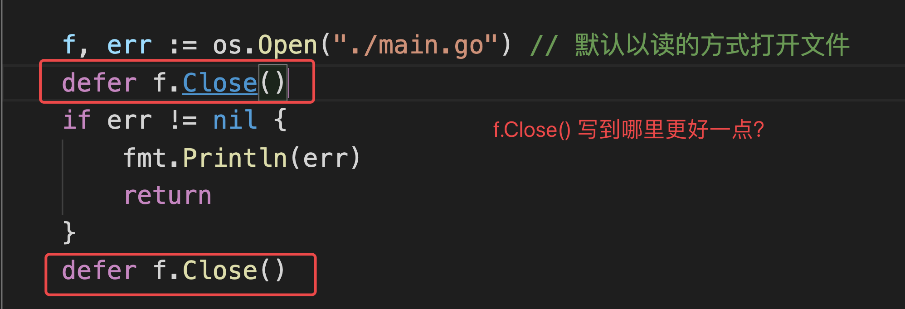

# day05课上笔记


## 内容回顾

自定义类型

```go
type Myint int

type f func()int
```

函数签名：函数需要的参数和返回值

类型别名

- Byte和rune 都是自带的类型别名
- type NewInt = int32

自定义类型和类型别名的区别？

- 类型别名编译后就会被替换成原来的类型，只是为了在开发阶段形象一点。

结构体

- 定义方式

  ```go
  type Student struct{
    ID int 
    Name string
  }
  ```

- 结构体初始化
- 结构体的内存布局
  - 结构体占用的内存是连续的。
  - 结构体的大小是由结构体的字段决定的
  - 结构体的内存对齐

- 空结构体
  
  - 空结构体不占空间
- 结构体匿名字段
- 结构体的嵌套
- 匿名结构体

方法

- 定义方式

  ```go
  func (s Student) Dream()string{
    // ...
  }
  ```

- 值接收者和指针接收者

结构体tag

json序列化

- json.Marshal
- json.Unmarshal

### 课后练习

1. 使用“面向对象”的思维方式编写一个学生信息管理系统。
   1. 学生有id、姓名、年龄、分数等信息
   2. 程序提供展示学生列表、添加学生、编辑学生信息、删除学生等功能

完整代码在课上代码里。

2. 下面代码的执行结果是啥？

   ```go
   type student struct {
   	name string
   	age  int
   }
   
   func main() {
   	m := make(map[string]*student)
   	stus := []student{
   		{name: "小王子", age: 18},
   		{name: "娜扎", age: 23},
   		{name: "大王八", age: 9000},
   	}
   
   	for _, stu := range stus {
   		m[stu.name] = &stu
   	}
   	for k, v := range m {
   		fmt.Println(k, "=>", v.name)
   	}
   }
   ```


课堂代码

```go
package main

import "fmt"

type student struct {
	name string
	age  int
}

func main() {
	m := make(map[string]*student)

	// x := []int{1, 2, 3}

	// x := []int{
	// 	1,
	// 	2,
	// 	3,
	// }

	// stus := []student{
	// 	student{name: "小王子", age: 18},
	// 	student{name: "娜扎", age: 23},
	// 	student{name: "大王八", age: 9000},
	// }

	stus := []student{
		{name: "杨俊", age: 18},
		{name: "吴勇", age: 23},
		{name: "jade", age: 9000},
	}

	// 将切片中的学生赋值到map中
	// 编程世界里的刻舟求剑
	// for _, stu := range stus {
	// 	m[stu.name] = &stu
	// }

	for i := 0; i < len(stus); i++ {
		stu := stus[i]
		m[stu.name] = &stu
	}

	// 遍历map中的键值对
	for k, v := range m {
		fmt.Printf("k:%v v:%p \n", k, v)
	}

	// 杨俊 => 杨俊
	// 吴勇 => 吴勇
	// jade => jade
}

```


## 今日内容

### 标准库fmt包

https://www.liwenzhou.com/posts/Go/go_fmt/

#### 输出

fmt.Print

fmt.Printf

fmt.Println


#### 输入

fmt.Scan

```go
func main() {
	var (
		name    string
		age     int
		married bool
	)
	fmt.Scan(&name, &age, &married)
	fmt.Printf("扫描结果 name:%s age:%d married:%t \n", name, age, married)
}
```


### 文件操作

https://www.liwenzhou.com/posts/Go/go_file/

#### file.Read()

```go
package main

import (
	"fmt"
	"io"
	"os"
)

func main() {
  	// 只读方式打开当前目录下的main.go文件
	file, err := os.Open("./main.go")
	if err != nil {
		fmt.Println("open file failed,err;", err)
		return
	}
	defer file.Close()
	var content []byte
	var tmp = make([]byte, 128)
	for {
		n, err := file.Read(tmp)
		if err == io.EOF {
			fmt.Println("文件读取完了")
			break
		}
		if err != nil {
			fmt.Println("read file failed ,err:", err)
			return
		}
		content = append(content, tmp[:n]...)
	}
	fmt.Println(string(content))
}

```


#### buffo 读取文件

```go
package main

import (
	"bufio"
	"fmt"
	"io"
	"os"
)

// bufio按行读取示例
func main() {
	file, err := os.Open("./xx.txt")
	if err != nil {
		fmt.Println("open file failed, err:", err)
		return
	}
	defer file.Close()
	reader := bufio.NewReader(file)
	for {
		line, err := reader.ReadString('\n') //注意是字符
		if err == io.EOF {
			if len(line) != 0 {
				fmt.Println(line)
			}
			fmt.Println("文件读完了")
			break
		}
		if err != nil {
			fmt.Println("read file failed, err:", err)
			return
		}
		fmt.Print(line)
	}
}

```


#### ioutil读取整个文件

```go
package main

import (
	"fmt"
	"io/ioutil"
)

// ioutil.ReadFile读取整个文件
func main() {
	content, err := ioutil.ReadFile("./main.go")
	if err != nil {
		fmt.Println("read file failed, err:", err)
		return
	}
	fmt.Println(string(content))
}

```

#### Write 和 WriteString

```go
package main

import (
	"fmt"
	"os"
)

func main() {
	file, err := os.OpenFile("xx.txt", os.O_CREATE|os.O_TRUNC|os.O_WRONLY, 0666)
	if err != nil {
		fmt.Println("open file failed ,err:", err)
		return
	}
	defer file.Close()
	str := "hello 沙河\n"
	file.Write([]byte(str))  // 直接写入切片数据
	file.WriteString("hello 小王子") // 直接写入字符串数据

}

```

#### bufio.NewWriter

```go
package main

import (
	"bufio"
	"fmt"
	"os"
)

func main() {
	file, err := os.OpenFile("xx.txt", os.O_CREATE|os.O_TRUNC|os.O_WRONLY, 0666)
	if err != nil {
		fmt.Println("open file failed ,err:", err)
		return
	}
	defer file.Close()
	writer := bufio.NewWriter(file)
	for i := 0; i < 10; i++ {
		writer.WriteString("hello 沙河 \n") //将数据写入缓存
	}
	writer.Flush() // 将缓存数据写入文件
}

```

#### ioutil.WriteFile

```go
package main

import (
	"fmt"
	"io/ioutil"
)

func main() {
	str := "hello 沙河"
	err := ioutil.WriteFile("./xx.txt", []byte(str), 0666)
	if err != nil {
		fmt.Println("writer file failed ,err:", err)
		return
	}
}

```




解答： 正常情况下写后面好些，前面的open是没有报错的，再去关闭就是安全的

自己把课上的示例代码敲一遍，有个印象。


### 接口

https://www.liwenzhou.com/posts/Go/12-interface/


#### 接口定义

```go
type 接口类型名 interface{
    方法名1( 参数列表1 ) 返回值列表1
    方法名2( 参数列表2 ) 返回值列表2
    …
}
```


#### 实现接口的条件

```go
// Singer 接口
type Singer interface {
  Sing()
}

type Bird struct{}

// Sing Bird类型的Sing方法    Bird实现了Singer接口
func (b Bird) Sing(){
  fmt.Println("汪汪汪")
}
```

#### 面向接口编程

```go
package main

import (
	"fmt"
)

type Payer interface {
	Pay(int64)
}
type ZhiFuBao struct {
	//支付宝
}
type WeChat struct {
	//微信
}

func (z *ZhiFuBao) Pay(amount int64) {
	fmt.Printf("使用支付宝付款%.2f 元 \n", float64(amount/100))
}
func (w *WeChat) Pay(amount int64) {
	fmt.Printf("使用微信付款%.2f 元 \n", float64(amount/100))
}
func Checkout(obj Payer) {
	//支付100
	obj.Pay(100)
}

func main() {
	Checkout(&ZhiFuBao{})
	Checkout(&WeChat{})
}

```


#### 接口组合

```go
// src/io/io.go

type Reader interface {
	Read(p []byte) (n int, err error)
}

type Writer interface {
	Write(p []byte) (n int, err error)
}

type Closer interface {
	Close() error
}

// ReadWriter 是组合Reader接口和Writer接口形成的新接口类型
type ReadWriter interface {
	Reader
	Writer
}

// ReadCloser 是组合Reader接口和Closer接口形成的新接口类型
type ReadCloser interface {
	Reader
	Closer
}

// WriteCloser 是组合Writer接口和Closer接口形成的新接口类型
type WriteCloser interface {
	Writer
	Closer
}
```


#### 结构体内部包含匿名接口类型

1. 默认就实现了该接口类型
2. 可以重写接口的方法
3. 但是一定要确保这个接口字段被正确初始化


#### 空接口

空接口是指没有定义任何方法的接口类型。因此任何类型都可以视为实现了空接口。也正是因为空接口类型的这个特性，空接口类型的变量可以存储任意类型的值。

```go
package main

import "fmt"

// 空接口

// Any 不包含任何方法的空接口类型
// type Any interface{}

// Dog 狗结构体
type Dog struct{}

func main() {
	// var x Any
	var x interface{} // 声明一个空接口类型变量x
	x = "你好"          // 字符串型
	fmt.Printf("type:%T value:%v\n", x, x)
	x = 100 // int型
	fmt.Printf("type:%T value:%v\n", x, x)
	x = true // 布尔型
	fmt.Printf("type:%T value:%v\n", x, x)
	x = Dog{} // 结构体类型
	fmt.Printf("type:%T value:%v\n", x, x)
}

```


空接口应用

```go
package main

import "fmt"

// 空接口作为函数参数
func show(a interface{}) {
	fmt.Printf("type:%T value:%v \n", a, a)
}

func main() {
	//空接口作为map值
	var studentInfo = make(map[string]interface{})
	studentInfo["name"] = "沙河小王子"
	studentInfo["age"] = 18
	studentInfo["married"] = false
	fmt.Println(studentInfo)
}

```


#### 接口值

由于接口类型的值可以是任意一个实现了该接口的类型值，所以接口值除了需要记录具体**值**之外，还需要记录这个值属于的**类型**。也就是说接口值由“类型”和“值”组成，鉴于这两部分会根据存入值的不同而发生变化，我们称之为接口的动态类型和动态值。

#### 类型断言

```go
package main

import "fmt"

type Mover interface {
	Move()
}

type Dog struct {
	Name string
}

func (d Dog) Move() {
	fmt.Println("狗会跑")
}

type Car struct {
	Brand string
}

func (c Car) Move() {
	fmt.Println("汽车会跑")
}
func main() {
	var m Mover
	m = &Dog{Name: "旺财"}
	fmt.Printf("%T \n", m) // *main.Dog

	m = new(Car)
	fmt.Printf("%T \n", m) // *main.Car

	var n Mover = &Dog{Name: "wang财"}
	v, ok := n.(*Dog)
	if ok {
		fmt.Println("类型断言成功")
		v.Name = "富贵"
	} else {
		fmt.Println("类型断言失败")
	}

}

```


## 本周作业

1. 自己把课上文件操作的示例代码敲一遍，有个印象。

2. 预习包的概念和go module

   https://www.liwenzhou.com/posts/Go/11-package/

   
