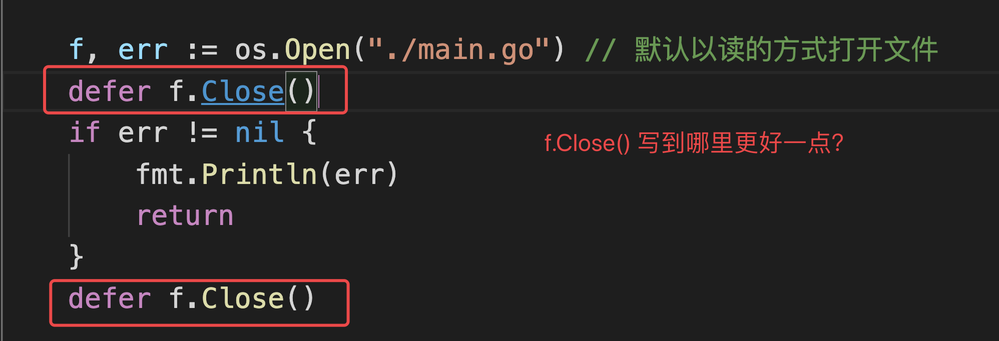
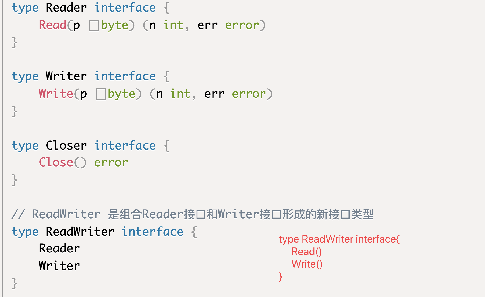

# day05课上笔记


## 内容回顾

自定义类型

```go
type Myint int

type f func()int
```

函数签名：函数需要的参数和返回值

类型别名

- Byte和rune 都是自带的类型别名
- type NewInt = int32

自定义类型和类型别名的区别？

- 类型别名编译后就会被替换成原来的类型，只是为了在开发阶段形象一点。

结构体

- 定义方式

  ```go
  type Student struct{
    ID int 
    Name string
  }
  ```

- 结构体初始化
- 结构体的内存布局
  - 结构体占用的内存是连续的。
  - 结构体的大小是由结构体的字段决定的
  - 结构体的内存对齐

- 空结构体
  - 空结构体不占空间
- 结构体匿名字段
- 结构体的嵌套
- 匿名结构体

方法

- 定义方式

  ```go
  func (s Student) Dream()string{
    // ...
  }
  ```

- 值接收者和指针接收者

结构体tag

json序列化

- json.Marshal
- json.Unmarshal

### 课后练习

1. 使用“面向对象”的思维方式编写一个学生信息管理系统。
   1. 学生有id、姓名、年龄、分数等信息
   2. 程序提供展示学生列表、添加学生、编辑学生信息、删除学生等功能

完整代码在课上代码里。

2. 下面代码的执行结果是啥？

   ```go
   type student struct {
   	name string
   	age  int
   }
   
   func main() {
   	m := make(map[string]*student)
   	stus := []student{
   		{name: "小王子", age: 18},
   		{name: "娜扎", age: 23},
   		{name: "大王八", age: 9000},
   	}
   
   	for _, stu := range stus {
   		m[stu.name] = &stu
   	}
   	for k, v := range m {
   		fmt.Println(k, "=>", v.name)
   	}
   }
   ```


课堂代码

```go
package main

import "fmt"

type student struct {
	name string
	age  int
}

func main() {
	m := make(map[string]*student)

	// x := []int{1, 2, 3}

	// x := []int{
	// 	1,
	// 	2,
	// 	3,
	// }

	// stus := []student{
	// 	student{name: "小王子", age: 18},
	// 	student{name: "娜扎", age: 23},
	// 	student{name: "大王八", age: 9000},
	// }

	stus := []student{
		{name: "杨俊", age: 18},
		{name: "吴勇", age: 23},
		{name: "jade", age: 9000},
	}

	// 将切片中的学生赋值到map中
	// 编程世界里的刻舟求剑
	// for _, stu := range stus {
	// 	m[stu.name] = &stu
	// }

	for i := 0; i < len(stus); i++ {
		stu := stus[i]
		m[stu.name] = &stu
	}

	// 遍历map中的键值对
	for k, v := range m {
		fmt.Printf("k:%v v:%p \n", k, v)
	}

	// 杨俊 => 杨俊
	// 吴勇 => 吴勇
	// jade => jade
}

```


## 今日内容

### 标准库fmt包

https://www.liwenzhou.com/posts/Go/go_fmt/

#### 输出

fmt.Print

fmt.Printf

fmt.Println


#### 输入

fmt.Scan

### 文件操作

https://www.liwenzhou.com/posts/Go/go_file/




解答： 正常情况下写后面好些，前面的open是没有报错的，再去关闭就是安全的

自己把课上的示例代码敲一遍，有个印象。


### 接口

https://www.liwenzhou.com/posts/Go/12-interface/


#### 接口定义


#### 实现接口的条件


#### 接口组合




#### 结构体内部包含匿名接口类型

1. 默认就实现了该接口类型
2. 可以重写接口的方法
3. 但是一定要确保这个接口字段被正确初始化


#### 空接口


#### 接口值


#### 类型断言


## 本周作业

1. 自己把课上文件操作的示例代码敲一遍，有个印象。

2. 预习包的概念和go module

   https://www.liwenzhou.com/posts/Go/11-package/

   
