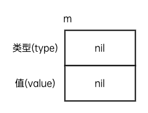
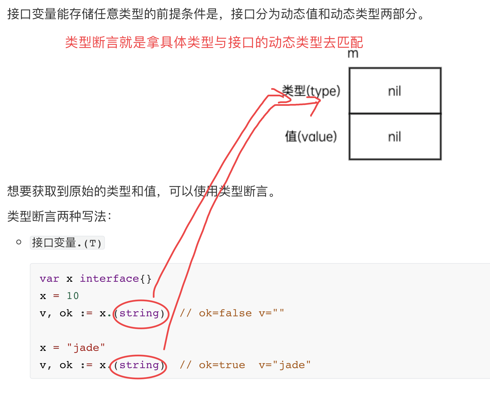
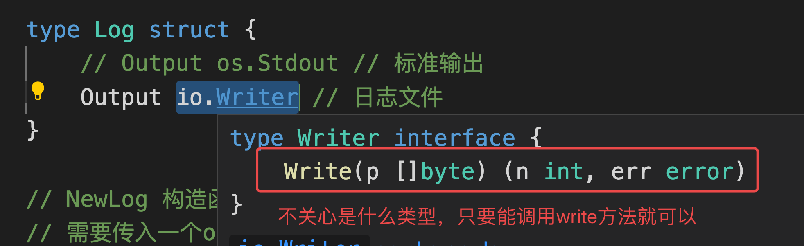
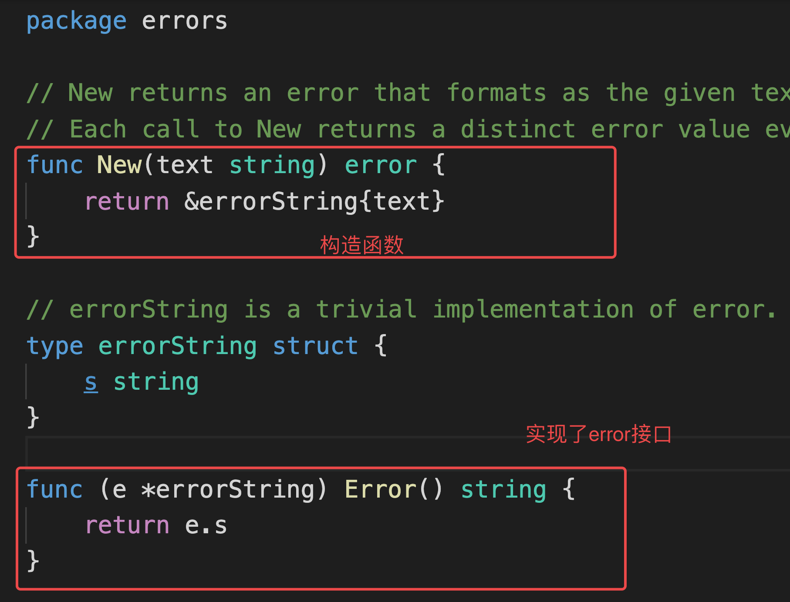
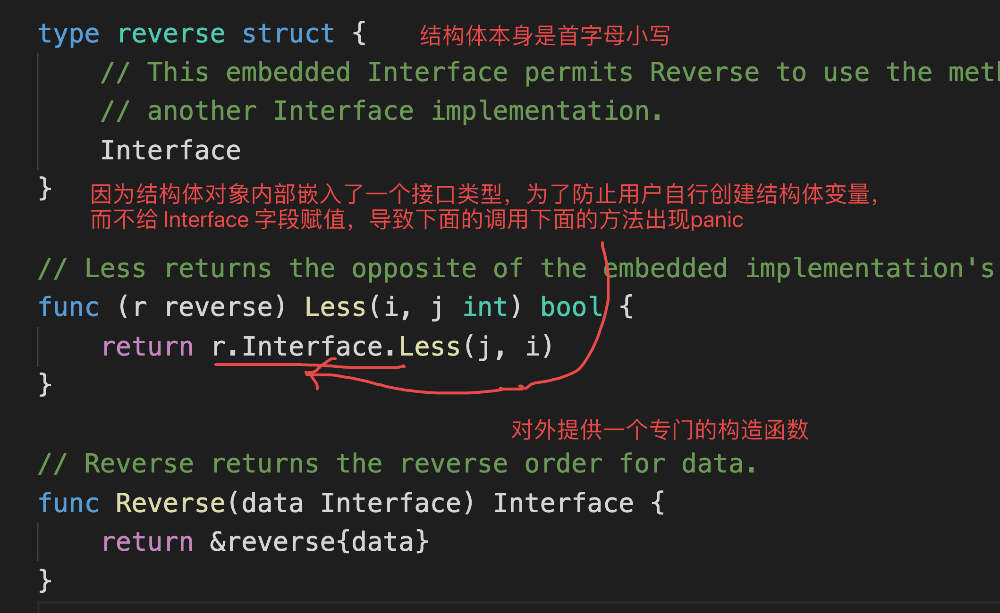
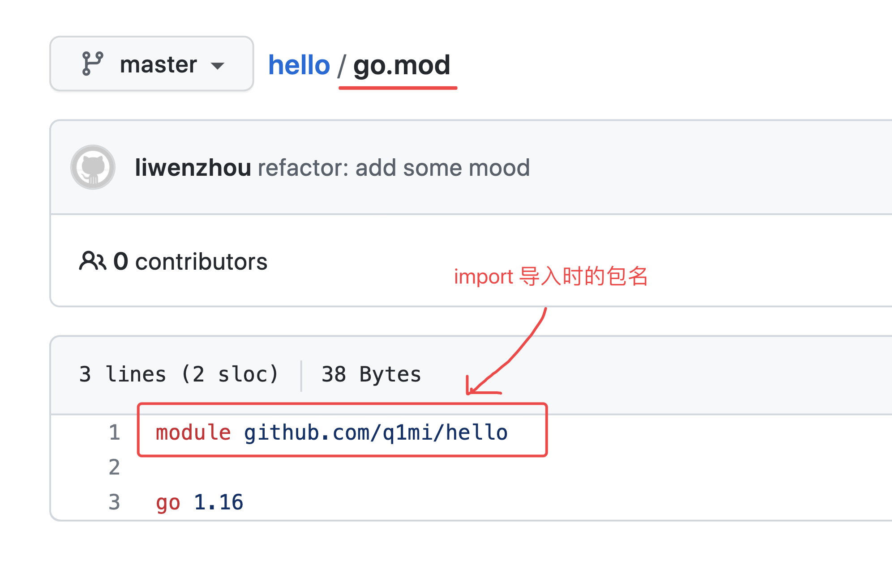
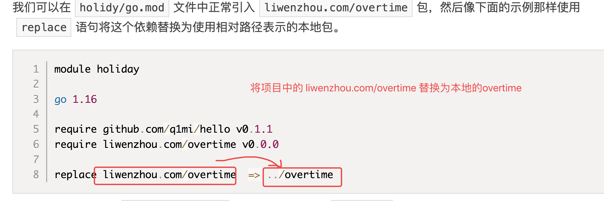
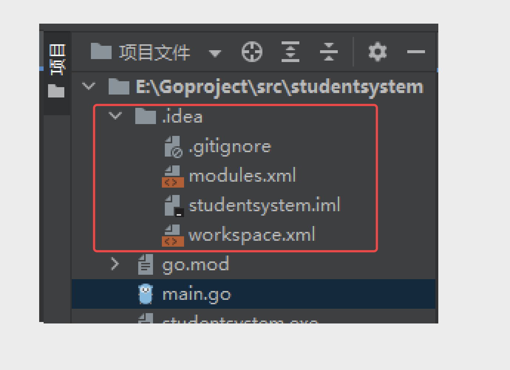

# day06课上笔记


## 内容回顾


### 接口

**接口是一种类型，是一种抽象的类型。**

```go
// Student 是我们定义的一个具体类型
type Student struct {
  Name string
  Age uint8
}
```

接口是**抽象**的类型，基于能做什么抽象出来的一种类型。

```go
type Dreamer interface{
  Dream()
}
```

**引申**

强类型的语言一直都在强调类型。

### 接口的知识点

- 为什么要使用接口？

  面向接口

  解耦

  抽象

  现有支付宝支付后面扩展微信支付的例子

- 接口的定义

  ```go
  type Runner interface{
    run()  // 方法签名
    say()
  }
  ```

- 实现接口的条件

  一个类型只要拥有了接口中规定的**所有**方法，那么它就实现了这个接口。

  ```go
  type Myint int
  type Func func()string
  type Dog struct{}
  ```

- 接口值

  接口类型默认零值是 `nil`

  一个接口类型的值能够存储任意满足该接口类型的变量。

- 指针接收者实现接口与值接收者实现接口的区别

  - 使用值接收者实现接口，值和指针都能赋值给接口变量
  - 使用指针接收者实现接口，只有指针都能赋值给接口变量

  字面量："jade"、10，字面量是无法取地址的。

  变量：`name := "jade"`，变量可以取地址：`&name`

- 结构体与接口类型的关系

  一个结构体可以实现多个接口

  多个结构体可以实现一个接口

  结构体可以内嵌接口类型

- 接口组合

  ```go
  type Closer interface {
    Close()
  }
  
  type Reader interface{
    Read()
  }
  
  type ReadCloser interface{
    Reader  // 嵌入另外一个接口类型
    Close()
  }
  ```

- 空接口

  没有要求任何方法的接口类型。

  反过来任意类型都实现了空接口。

  ```go
  type Any interface {
    
  }
  ```

  通常简写为`interface{}`

  ```go
  var x interface{}  // 声明一个空接口类型的变量x
  
  var m0 = map[string]int{
    "jade": 199,
  }
  
  // 字面量初始化
  var m = map[string]interface{}{
    "jade": 199,
  }
  
  // 此时map需要初始化
  var m2 map[string]interface{}
  m2 = make(map[string]interface{}, 8)
  m2["jade"] = 199
  ```

- 类型断言

  接口变量能存储任意类型的前提条件是，接口分为动态值和动态类型两部分。

  

  想要获取到原始的类型和值，可以使用类型断言。

  类型断言两种写法：

  - `接口变量.(T)`

    ```go
    var x interface{}
    x = 10
    v, ok := x.(string)  // ok=false v=""
    
    x = "jade"
    v, ok := x.(string)  // ok=true  v="jade"
    ```

    

  - `switch x.(type)`

    ```go
    var x interface{}
    x = 100
    
    switch v := x.(type){
      case int:
      // v = 100
      case string:
      // ....
    }
    ```

    

### fmt包

熟悉常用函数的用法

### 文件操作

熟悉常用函数的用法

### 作业

使用接口实现一个简单的日志库




```go
package main

import (
	"fmt"
	"io"
	"os"
)

// 使用接口实现一个简单的日志库
// 既能往终端输出也能往文件输出日志

// log.Error()
// log.Warning()
// log.Info("...")

type Log struct {
	// Output os.Stdout // 标准输出
	Output io.Writer // 日志文件
}

// NewLog 构造函数中指定要输出的地方
// 需要传入一个output参数，告诉我将日志输出到哪里
func NewLog(output io.Writer) *Log {
	return &Log{
		Output: output,
	}
}

func (l *Log) Error(s string) {

}

func (l *Log) Warning(s string) {

}

func (l *Log) Info(s string) {
	// 把要记录的日志信息s 输出
	// 有可能会输出到 os.Stdout
	// 有可能出输出到 os.File
	// ....

	// 我只需要写东西...
	fmt.Fprintln(l.Output, s)

}

func main() {
	// 往终端输出日志
	// logger := NewLog(os.Stdout)
	// 往文件里面输出日志
	f, err := os.OpenFile("./app.log", os.O_CREATE|os.O_APPEND|os.O_WRONLY, 0644)
	if err != nil {
		fmt.Println("创建日志文件失败, err:", err)
		return
	}
	defer f.Close() // 程序退出前关闭文件

	logger := NewLog(f) // 把打开的文件对象传入构造函数

	logger.Info("程序启动啦")

	logger.Warning("感觉程序要出问题啦")
	logger.Error("程序出错误啦")
}

// 1. 日志构造函数中可以指定日志级别 level
// 2. error级别的日志还可以输出到另外一个文件 app.err.log
// 3. 日志文件可以限制大小，最大500M,支持自动切割日志文件

```


## 今日内容

### Error接口和错误处理

https://www.liwenzhou.com/posts/Go/error/

#### error接口

```go
type error interface {
	Error() string
}
```


默认零值为 `nil`


#### errors.New  本质




`fmt.Errorf("%w", err)`


### 包和go module


`project` ：项目  ---> 一个VsCode窗口 或者 一个GoLand窗口 打开一个项目（project）

`package`:包  --> 一个project 可以由多个 package 组成  

`.go`文件：源码文件 


#### 标识符的可见性


**标识符的首字母 什么时候大写，什么时候小写 都是有考量的！！！**




#### go module


##### go get 下载依赖

默认下载最新版本

```bash
go get github.com/q1mi/hello
```

下载指定版本

```bash
go get github.com/q1mi/hello@v0.1.0
```


默认下载到 `$gopath/pkg/mod/`目录下


导入的路径名由被引入的包的 module 定义



##### go.mod 中 replace 替换语法


GoLand 有时候会出现引入的依赖包一直标红，但是项目能正常编译执行。

这种情况下代码没问题，基本上可以断定是GoLand抽风了。

可以先关掉GoLand，然后把项目目录下的`.idea`这个目录删掉。 文件管理器找不到的话就用命令行删`rm -rf ./.idea`。

再重新打开GoLand 就可以了。




### 反射

https://www.liwenzhou.com/posts/Go/13_reflect/

了解为主。

程序运行的时候动态的获取变量值或者类型。

两个函数`reflect.TypeOf` 和 `reflect.ValueOf`


结构体反射是重点。


## 本周作业

1. 编写一个`calc`包实现加减乘除四个功能函数，在`snow`这个包中引入`calc`包并调用其加减乘除四个函数实现数学运算。

2. 利用学到的反射的内容实现以下函数， 把error都用上

   ```go
   // loadStudentData 从文件中加载数据到Student结构体
   func loadStudentData(filename string, obj interface{}) error {
   	// 0. 前置检查
   	// 0.1 obj必须是指针类型，不是就返回错误
   	// 0.2 obj必须是结构体指针, 不是就返回错误
   	// 1. 一行一行读取文件中的内容，解析成键值对 （读一行处理一行）
   	// 2. 根据key去结构体里找字段名
   	// 3. 找到之后赋值
   	return nil
   }
   ```


答案：

```go
package main

import (
	"errors"
	"fmt"
	"io/ioutil"
	"reflect"
	"strconv"
	"strings"
)

var (
	NeedPtrErr       = errors.New("必须传入指针类型")
	NeedStructPtrErr = errors.New("必须传入结构体指针类型")
)

type Student struct {
	Name  string  `info:"name"`
	Age   int     `info:"age"`
	Score float64 `info:"score"`
}

// 从文件加载数据到Student结构体
func loadStudentData(filename string, obj interface{}) error {
	// 0，检查 obj interface{}
	// obj必须是指针类型
	// 如果不是，就返回错误
	tInfo := reflect.TypeOf(obj)
	vInfo := reflect.ValueOf(obj)
	// tInfo.Name()  // 类型名称
	// tInfo.Kind()  // 种类
	if tInfo.Kind() != reflect.Ptr {
		return NeedPtrErr
	}
	// obj必须是结构体指针
	// 如果不是，就返回错误
	// tInfo.Elem()  // 根据指针取到对应的值
	if tInfo.Elem().Kind() != reflect.Struct {
		return NeedStructPtrErr
	}

	// 1,一行行读取文件中的内容，解析键值对，读一行处理一行
	// 1.1 读文件
	b, err := ioutil.ReadFile(filename) // 文件不大的情况下
	if err != nil {
		fmt.Printf("打开文件失败，err：%v", err)
		return err
	}
	// []byte -> string
	s := string(b)
	lines := strings.Split(s, "\n") // 按换行符分隔
	for _, line := range lines {
		if len(strings.TrimSpace(line)) == 0 {
			continue // 跳过配置文件中的空行
		}
		// 按=分隔，拿到键值对
		list := strings.Split(line, "=") // [""]
		// 去掉首尾的空格
		key := strings.TrimSpace(list[0])
		value := strings.TrimSpace(list[1])
		// 2，根据key 去结构体里找字段的 info tag == key
		// 2.1 遍历结构体的所有字段
		for i := 0; i < tInfo.Elem().NumField(); i++ {
			field := tInfo.Elem().Field(i) // 拿到一个具体的结构体字段
			// field.Name == key
			if field.Tag.Get("info") == key {
				// 说明我们找到了对应配置文件中的那个字段
				// 3，找到后赋值
				vField := vInfo.Elem().Field(i)
				switch vField.Type().Kind() {
				case reflect.String:
					vField.SetString(value)
				case reflect.Int, reflect.Int8, reflect.Int16, reflect.Int32, reflect.Int64:
					// 注意：value是字符串
					// strconv.Atoi()  // string -> int
					int64Value, err := strconv.ParseInt(value, 10, 64)
					if err != nil {
						return err
					}
					vField.SetInt(int64Value)
				case reflect.Float32, reflect.Float64:
					float64Value, err := strconv.ParseFloat(value, 64)
					if err != nil {
						return err
					}
					vField.SetFloat(float64Value)
				}

			}

		}
	}
	return nil

}

func main() {

	var stu Student
	err := loadStudentData("info.txt", &stu)
	if err != nil {
		fmt.Println(err)
		return
	}
	fmt.Printf("%#v\n", stu)


}

```


Info.txt

```text
name = 杨俊

age=28

score=99.5
```

