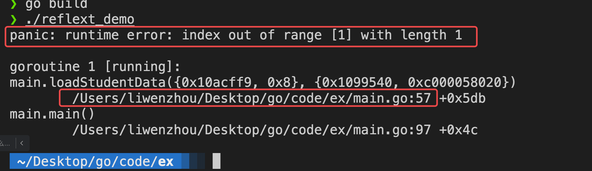
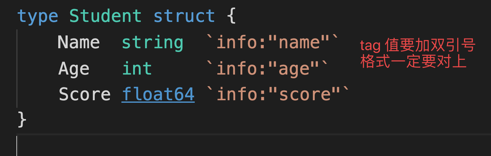
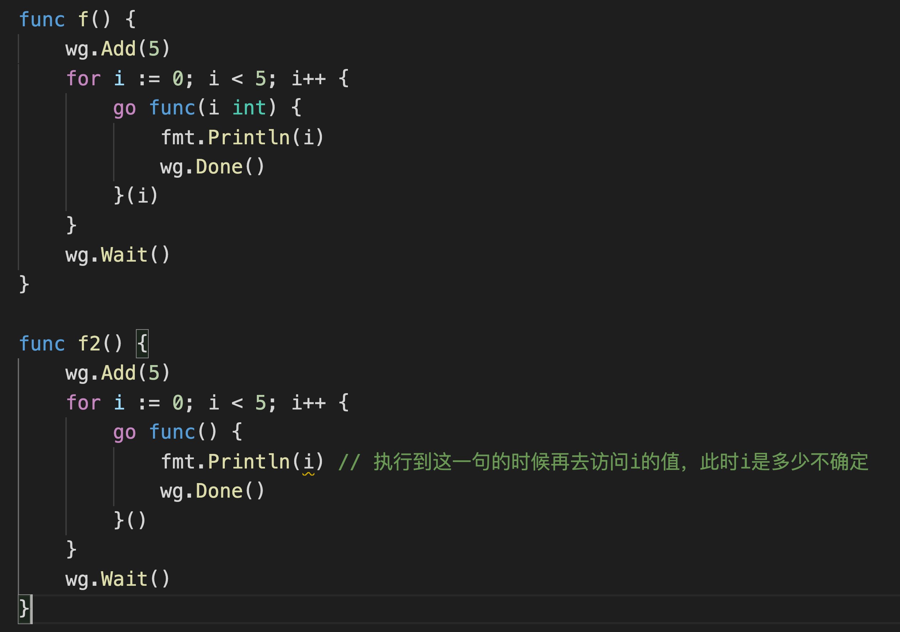
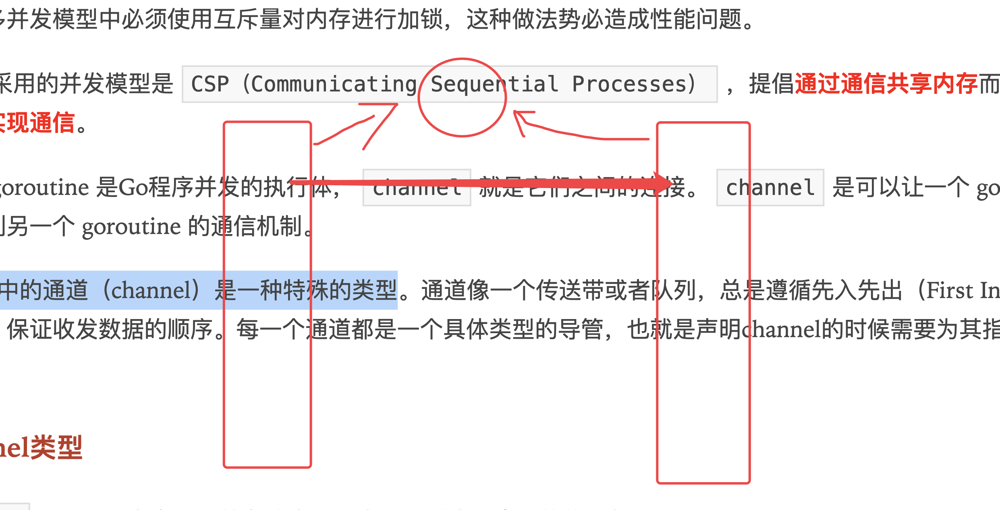

# day07课上笔记


## 内容回顾


### Error接口和错误处理

Go语言中的所有的错误是一个`error`类型，`error`是一个接口类型 。

```go
type error interface{
  Error()string
}
```

#### 自己定义错误类型的方式

1.

```go
errors.New("数据库查询失败")
```

2. 

```go
errors.New(fmt.Sprintf("%v:查询失败"), v)

fmt.Errorf("%v:查询失败", v)

// 基于一个已有的err,包装得到自己的错误
fmt.Errorf("%w：查询失败", err)  // %w搭配的是err
```

3.自己定义结构体错误类型，实现error接口

```go
// MySQLError 自定义一个错误结构体类型
type MySQLError struct{
  Code int
  Msg  string
}

// Error 实现error接口要求的方式
func (e *MySQLError)Error()string{
  return e.Msg
}

var err MySQLError = MySQLError{Code:1, Msg:"查询失败"}
```


对于 `fmt.Errorf("%w", err)` 包装得到的err，我们还支持

```go
errors.Unwrap(err)
errors.Is()
errors.As()
```

错误处理见代码。

### gomodule

```bash
go mod download
go get ...
```

go.mod文件介绍

go.mod中replace语法

如何下载具体的版本

使用`github.com/q1mi/hello`

### 包

package xxx

### 反射

#### 两个信息

类型信息和值信息

#### 两个方法

类型：`reflect.TypeOf()`

值：`reflect.ValueOf()`


### 如何查看错误信息







```go
strconv.ParseInt("字符串", 进制， 位数)

x , _ := strconv.ParseInt("123", 10，8)  // var x int8 = 123

strconv.ParseFloat("字符串", 位数)
f , _ := strconv.ParseFloat("123.456", 32) // var f float32 = 123.456

```
类型转换可能失败，需要处理可能出现的错误

```go
n, err := strconv.ParseInt("嘿嘿嘿", 10, 64) // 把“嘿嘿嘿”转换成int64
if err != nil {                           // 转换失败
	fmt.Println(err)
}
// 转换失败n就是默认类型的零值
fmt.Println(n)
```

int转字符串

```go
// 把字符串转换为int类型
intValue, err := strconv.Atoi("123")
fmt.Println(intValue, err)
// 把int转为字符串
v := 68 // 68 -> "68"

// s := string(v)  // "D"  ascii码

s := strconv.Itoa(v)

fmt.Printf("%#v\n", s) // "68"

s2 := fmt.Sprintf("%v", v) // "68"
fmt.Printf("%#v\n", s2)
```


## 今日内容

### time包

https://www.liwenzhou.com/posts/Go/go-time/

时间对象

时间戳

时区

格式化时间

加载时间


### 并发

https://www.liwenzhou.com/posts/Go/concurrence/


### goroutine

CSP并发模型

goroutine概念

GPM调度模型



### channel

通过共享内存实现通信  --> 加锁

通过通信实现共享内存 --> channel





### 单向通道


### select


## 本周作业


