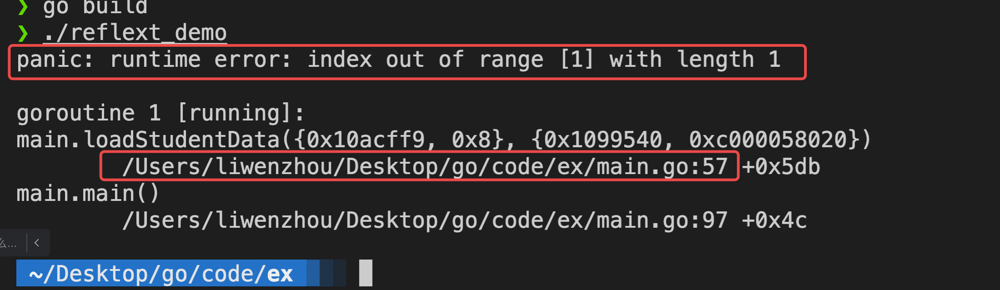
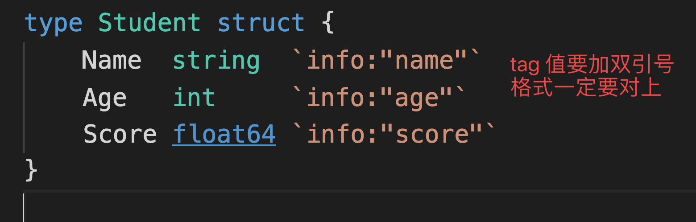
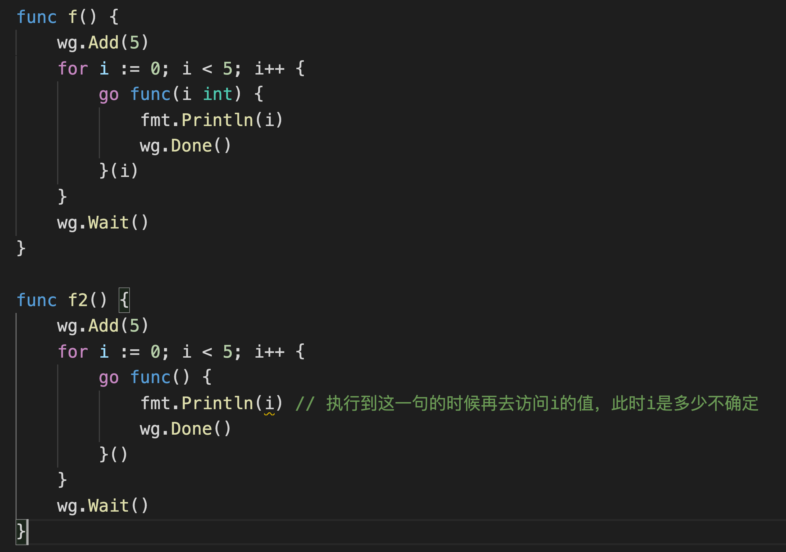

# day07课上笔记


## 内容回顾


### Error接口和错误处理

Go语言中的所有的错误是一个`error`类型，`error`是一个接口类型 。

```go
type error interface{
  Error()string
}
```

#### 自己定义错误类型的方式

1.

```go
errors.New("数据库查询失败")
```

2. 

```go
errors.New(fmt.Sprintf("%v:查询失败"), v)

fmt.Errorf("%v:查询失败", v)

// 基于一个已有的err,包装得到自己的错误
fmt.Errorf("%w：查询失败", err)  // %w搭配的是err
```

3.自己定义结构体错误类型，实现error接口

```go
// MySQLError 自定义一个错误结构体类型
type MySQLError struct{
  Code int
  Msg  string
}

// Error 实现error接口要求的方式
func (e *MySQLError)Error()string{
  return e.Msg
}

var err MySQLError = MySQLError{Code:1, Msg:"查询失败"}
```


对于 `fmt.Errorf("%w", err)` 包装得到的err，我们还支持

```go
errors.Unwrap(err)
errors.Is()
errors.As()
```

错误处理见代码。

### gomodule

```bash
go mod download
go get ...
```

go.mod文件介绍

go.mod中replace语法

如何下载具体的版本

使用`github.com/q1mi/hello`

### 包

package xxx

### 反射

#### 两个信息

类型信息和值信息

#### 两个方法

类型：`reflect.TypeOf()`

值：`reflect.ValueOf()`


### 如何查看错误信息







```go
strconv.ParseInt("字符串", 进制， 位数)

x , _ := strconv.ParseInt("123", 10，8)  // var x int8 = 123

strconv.ParseFloat("字符串", 位数)
f , _ := strconv.ParseFloat("123.456", 32) // var f float32 = 123.456

```
类型转换可能失败，需要处理可能出现的错误

```go
n, err := strconv.ParseInt("嘿嘿嘿", 10, 64) // 把“嘿嘿嘿”转换成int64
if err != nil {                           // 转换失败
	fmt.Println(err)
}
// 转换失败n就是默认类型的零值
fmt.Println(n)
```

int转字符串

```go
// 把字符串转换为int类型
intValue, err := strconv.Atoi("123")
fmt.Println(intValue, err)
// 把int转为字符串
v := 68 // 68 -> "68"

// s := string(v)  // "D"  ascii码

s := strconv.Itoa(v)

fmt.Printf("%#v\n", s) // "68"

s2 := fmt.Sprintf("%v", v) // "68"
fmt.Printf("%#v\n", s2)
```


### 补充 反射调用方法

```go
package main

import (
	"errors"
	"fmt"
	"io/ioutil"
	"reflect"
	"strconv"
	"strings"
)

var (
	NeedPtrErr       = errors.New("必须传入指针类型")
	NeedStructPtrErr = errors.New("必须传入结构体指针类型")
)

type Student struct {
	Name  string  `info:"name"`
	Age   int     `info:"age"`
	Score float64 `info:"score"`
}

func (s Student) Study(title string) {
	fmt.Printf("%s在学%s\n", s.Name, title)
}

func (s Student) Play(num int) {
	fmt.Printf("%s玩了%d小时\n", s.Name, num)
}

func Do(obj interface{}, methodName string, arg interface{}) {
	tInfo := reflect.TypeOf(obj)
	vInfo := reflect.ValueOf(obj)

	fmt.Println("方法数量：", tInfo.NumMethod()) // 看看结构体有多少方法
	// 根据传入方法名去结构体里找对应的方法
	m := vInfo.MethodByName(methodName)
	if !m.IsValid() || m.IsNil() {
		fmt.Println("调用方法失败")
		return
	}
	// 进行方法调用
	// 处理参数
	argValue := reflect.ValueOf(arg)
	m.Call([]reflect.Value{argValue})

}


func main() {

	// 通过反射调用方法
	Do(stu, "Study", "Go语言")
	Do(stu, "Play", 2)

}

```


## 今日内容

### time包

https://www.liwenzhou.com/posts/Go/go-time/

时间对象

时间戳

时区

格式化时间

加载时间


### 并发

https://www.liwenzhou.com/posts/Go/concurrence/


### goroutine

CSP并发模型

goroutine概念

GPM调度模型



### channel

通过共享内存实现通信  --> 加锁

通过通信实现共享内存 --> channel


```go
package main

import "fmt"

func recv(c chan int) {
	// ret := <-c
	// fmt.Println("接收成功", ret)
	/* 	for {
		v, ok := <-c
		if !ok {
			fmt.Println("通道已关闭")
			break
		}
		fmt.Printf("接收到值 v:%#v ok: %#v \n", v, ok)
	} */
	for v := range c {
		fmt.Printf("接收到值 v:%#v", v)  // 这里为什么接收不到20，上面for循环却可以
	}
}

func main() {
	var ch1 chan int
	// var ch2 chan bool
	// var ch3 chan []int
	fmt.Println(ch1) //<nil>

	ch2 := make(chan int)
	// ch3 := make(chan bool, 1) // // 声明一个缓冲区大小为1的通道
	go recv(ch2)
	ch2 <- 10 //把10发送到ch中 形成死锁，等待接收方才能发送成
	ch2 <- 20
	fmt.Println("发送成功")

}

```


### 单向通道


### select


## 本周作业


