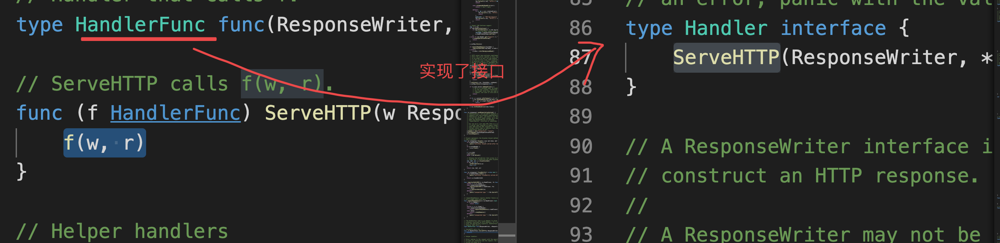

# day09课上笔记（25）


## 内容回顾

### sync包

解决并发过程中的数据竞争的问题。

sync.Mutex：互斥锁

sync.RWMutex：读写互斥锁；主要应用于读多写少的场景。

sync.Once：只执行一次；加载配置文件的例子

sync.Map：并发安全的map；原生的map不是并发安全的。

atomic：原子操作；对于数字类的加减

### 网络编程

常见的网络协议介绍

网络的分层模型

tcp

udp

### 单元测试

程序员自己写的单元测试，最好是养成写单测的习惯。

单元测试的格式要求

性能基准测试


### 作业讲解

实现一个回文判断函数，并为其编写单元测试。


王文建的代码：

1. 函数签名（函数名、参数、返回值）要直接、清晰、简单明了。
2. 无效代码
3. 函数内部变量名要有意义，不要有歧义


## 今日内容

### 单元测试补充

testcase

setup与teardown

Example函数


### 网络编程 net/http

https://www.liwenzhou.com/posts/Go/go_http/

#### 客户端

发送请求的那一端，发http请求，通常会有GET POST  。。。

```go
htto.Get()

http.Post()  
// form表单格式
// json格式
```

**url.Values**

```go
var query url.Value
```


#### 服务端




```go
func serverDemo() {

	// 做好准备：当客户端请求 127.0.0.1:8082/order?id=1234 会携带一个id
	// 我拿到id去查订单数据给用户返回
	// 注册陆路由方式1
	http.Handle("/order", http.HandlerFunc(f1)) // sum := int64(0)
	// 注册路由方式2
	http.HandleFunc("/hello", func(w http.ResponseWriter, r *http.Request) {
		fmt.Fprintf(w, "Hello, %q", html.EscapeString(r.URL.Path))
	})

	http.ListenAndServe(":8082", nil)
}
```

### Go并发context 

https://www.liwenzhou.com/posts/Go/go_context/


共有的问题：如何在goroutine外部通知goroutine退出？

- 全局变量
- 使用通道变量

有并发风险或者不好管理、不好形成统一的规范

Go1.7 之前都是程序员自己实现，Go1.7之后官方提供了一个统一的比较完善的方案——context。


context


想要从零开始创建Context，可以借助两个函数

```go
context.Background()
context.TODO()
```


#### with系列

```go
// WithCancel 得到一个字ctx和取消函数
ctx, cancel := context.WithCancel(context.Background())

now := time.Now()
ctx, cancel := context.WithDeadline(context.Background(), now.Add(5*time.Second))
defer cancel()

ctx, cancel := context.WithTimeout(context.Background(), 5*time.Second)
defer cancel()

type MyKey string
ctx := context.WithValue(context.Background(), MyKey("name"), "杨俊")
v, ok := ctx.Value(MyKey("name")).(string)
```


#### context推荐项目——日志收集


此外，还有一个我之前在培训机构讲的一个Go语言服务端开发项目实战：https://b23.tv/idab9a 自己动手写个日志收集，是练习goroutine和context的绝佳项目，可以作为进阶学习项目。


### goroutine错误处理与errgroup

下周讲


## 今日分享

人生就是要打好自己的牌。

人还是要多读书，不要做“俺也一样”的人。


## 本周作业

1. 课上context和http client端http服务端的例子自己写一下。


