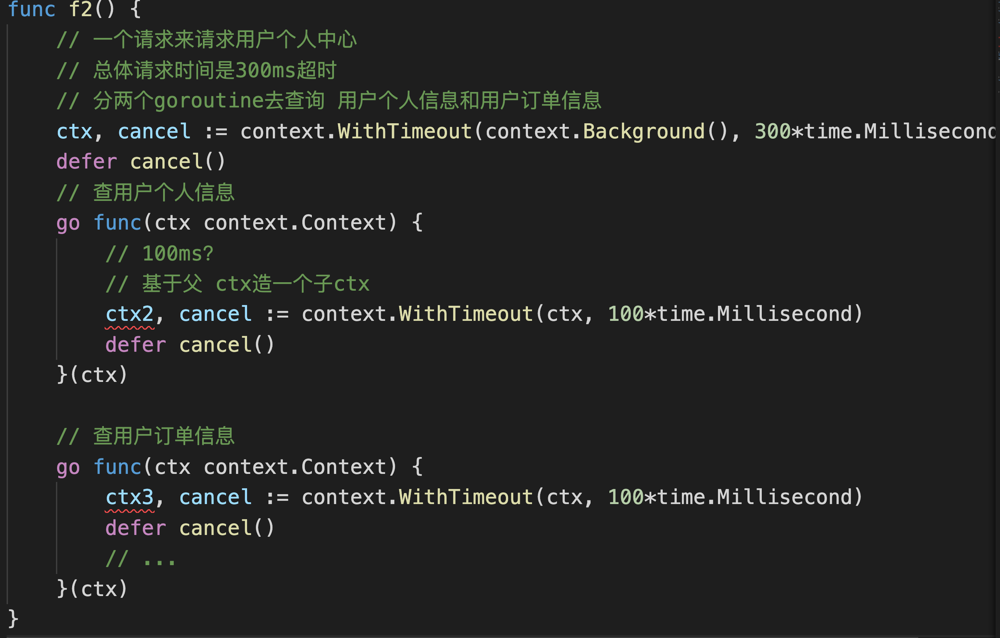
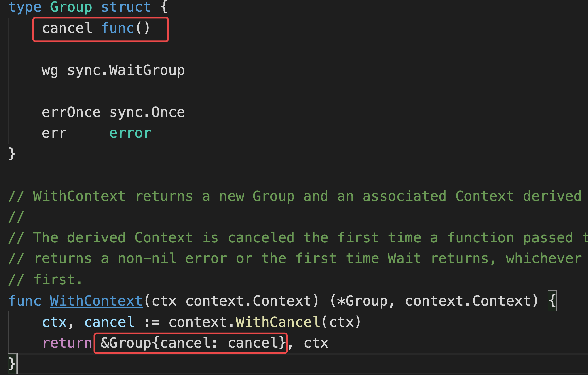
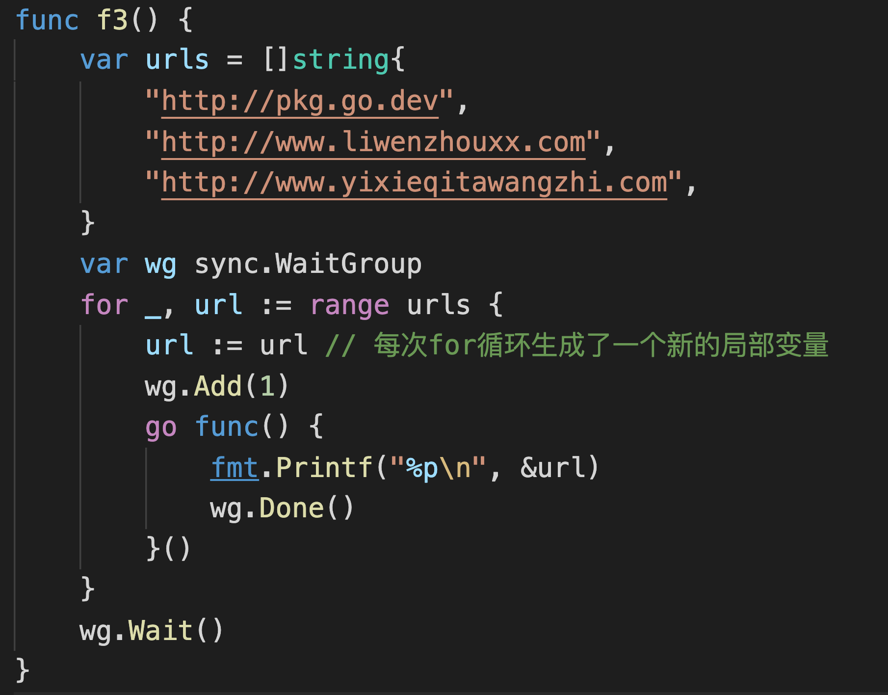
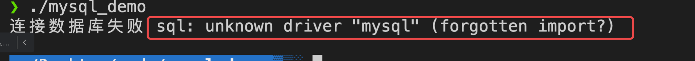

# day10课上笔记（26人）


## 内容回顾


### context（上下文）

#### context是干啥的

搭配goroutine干活的

- 通知 goroutine 退出
- 请求的场景下携带跟请求相关的数据

#### 为什么要用context

在 goroutine 外部如何通知 goroutine 退出？

统一的规范化的通知 goroutine 退出的机制。

#### context

context 本身不能实现 goroutine 的退出吗？ 不能

我们需要在 goroutine 中手动的处理 ctx.Done() 的信号

context 本质上是一个接口类型。

携带了 cancelFunc 、超时时间和 ctx.Done() ,以及携带请求相关数据

ctx.Done() 返回的是一个通道

当调用cancelFunc 或者 超时时间到了，ctx.Done() 返回的通道能接收到值。

#### context的用法

context.Background() 

```go
func WithCancel(parent Context) (ctx Context, cancel CancelFunc) 

func WithTimeout(parent Context, timeout time.Duration) (Context, CancelFunc)

func WithDeadline(parent Context, d time.Time) (Context, CancelFunc)
```

context.TODO()：假设你调用的一个函数必须传递一个context作为参数，但是你暂时还不知道用什么contex, 你就先给他先传个TODO占个位置 (类似于python中的pass)，保证函数正常调用。等到后续你明确了要用哪种context,你再把context.TODO替换掉。

**绝对不要**把context.TODO理解成下面杨俊说的这种用法。

>  老师，你看我的理解对么，就是还暂时用不到context的时候，先占个位置，就是ctx, cancel := context.WithCancel(context.ToDo())，然后业务代码正常传入ctx，等到准备好了，用到了，再把ctx, cancel := context.WithCancel(context.TODO())改成ctx, cancel := context.WithCancel(context.Background())，对吧

context.With系列的函数必须传递明确的ctx，正确的用法是：

- 如果你有别人给你的一个父ctx，那你就把父ctx传进去。

- 如果你没有父ctx或者你就是顶层的ctx,那么你就传一个 context.Backgroud()

##### 携带请求相关的数据

串联同一个请求下的多个 goroutine

```go
// 存值
func WithValue(parent Context, key, val interface{}) Context

// 取值
ctx.Value(key interface{})
```

注意事项：

1. 因为是空接口类型，存的时候任意存，取的时候要做类型断言

2. 不同的包 goroutine 中都可以对context设置值，可能存在key重复了，后面的赋值操作会覆盖前面的。

   1. context.WithValue(ctx, "name", "杨俊")
   2. context.WithValue(ctx, "name", "安小枫")

3. WithValue不要使用**基础数据类型**来作为key，避免被冲突。

4. 要使用自定义类型来作为key

   ```go
   type CtxKey int8
   
   const (
   	CtxName CtxKey = iota
   	CtxAge  CtxKey = iota
   	// ...
   )
   
   func f1() {
   	ctx := context.WithValue(context.Background(), CtxName, "杨俊")
   
   	// 根据key取值
   	value := ctx.Value(CtxName).(string) // 对取出的值做类型断言
   	fmt.Println(value)
   }
   ```


什么场景下要基于父ctx造子ctx?




context是支持在多个goroutine里操作的


## 今日内容

### 并发错误处理

https://www.liwenzhou.com/posts/Go/error-in-goroutine/

#### goroutine中的panic

**panic和error的区别是什么？**

error：是程序运行过程中预期可能出现的问题（错误）

panic：恐慌，是一些程序运行期间不可预期（意想不到的）的问题；代码写的有瑕疵

- 空指针
- 索引越界
- 死锁

程序遇到panic就崩掉了，可以通过recover实现平滑退出。


#### errgroup

适用场景：

适合大任务拆分成多个可以并发的子任务

提供的能力：

为那些子任务的goroutine提供 sync.Wait()、error传递、基于context的取消。




g.Go(func()error)：开启一个goroutine去执行任务，只执行一次将错误赋值给`g.err`，调用一次`g.cancel`

g.Wait() : 会等待所有的子任务goroutine完成, 返回的是`g.err`


errgroup.WithContext()

看一下示例，尝试理解。


for range循环




### 操作数据库


docker快速启动一个MySQL Server容器

```bash
docker run --name mysql8019 -p 3306:13306 -d -e MYSQL_ROOT_PASSWORD=root1234 mysql:8.0.19
```


```bash
docker run -d -p 3306:3306 --name mysql  -v /opt/mysql:/var/lib/mysql -e MYSQL_DATABASE=myblog -e MYSQL_ROOT_PASSWORD=123456 mysql:5.7 --character-set-server=utf8mb4 --collation-server=utf8mb4_unicode_ci
```


启动一个终端容器 连接上面的MySQL Server

```bash
docker run -it --network host --rm mysql:8.0.19 mysql -h127.0.0.1 -P13306 -uroot -p
```


出现这个错误就是没有导入驱动：




#### sql注入

用外部输入的内容直接拼接sql导致

### sqlx

#### in查询

```sql
select id, name, age from user where id in (?,?,?), (101,103,105);

insert into user (name, age) values((?,?),(?,?)) , ((jade,18), (lishuo,28))
```


## 本周作业

1. 把课上写的例子全部手敲一遍。


## 今日分享

在知道生活的真像后仍然热爱生活。


