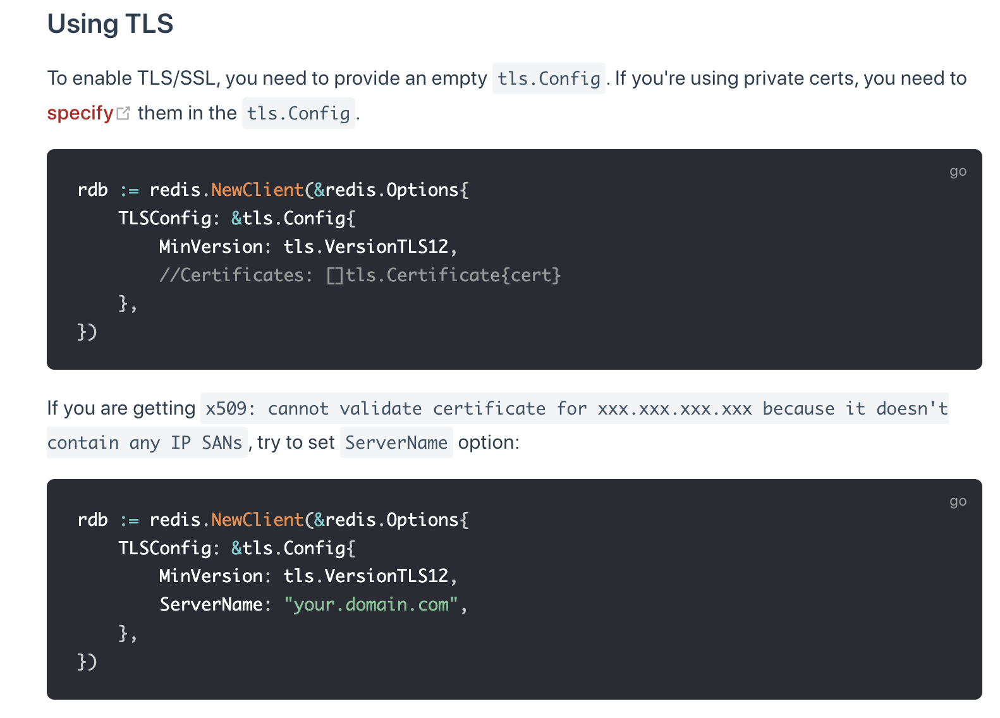
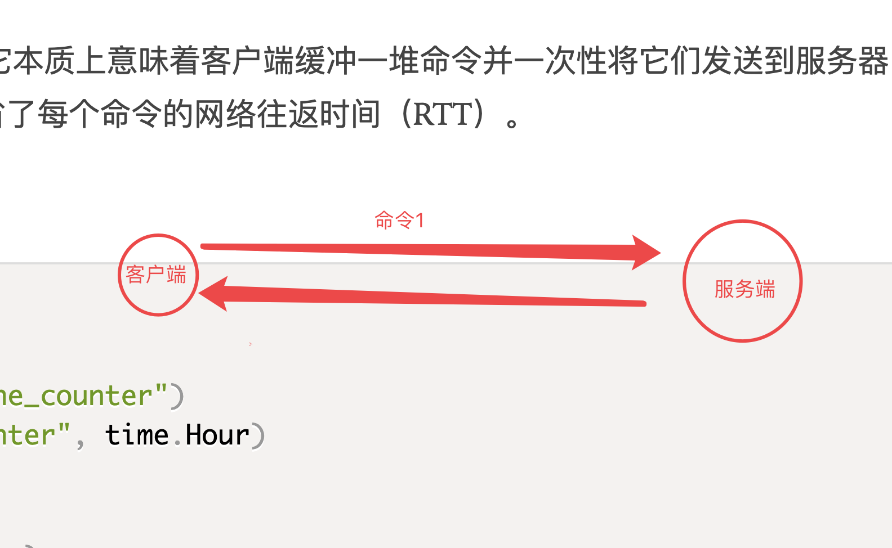
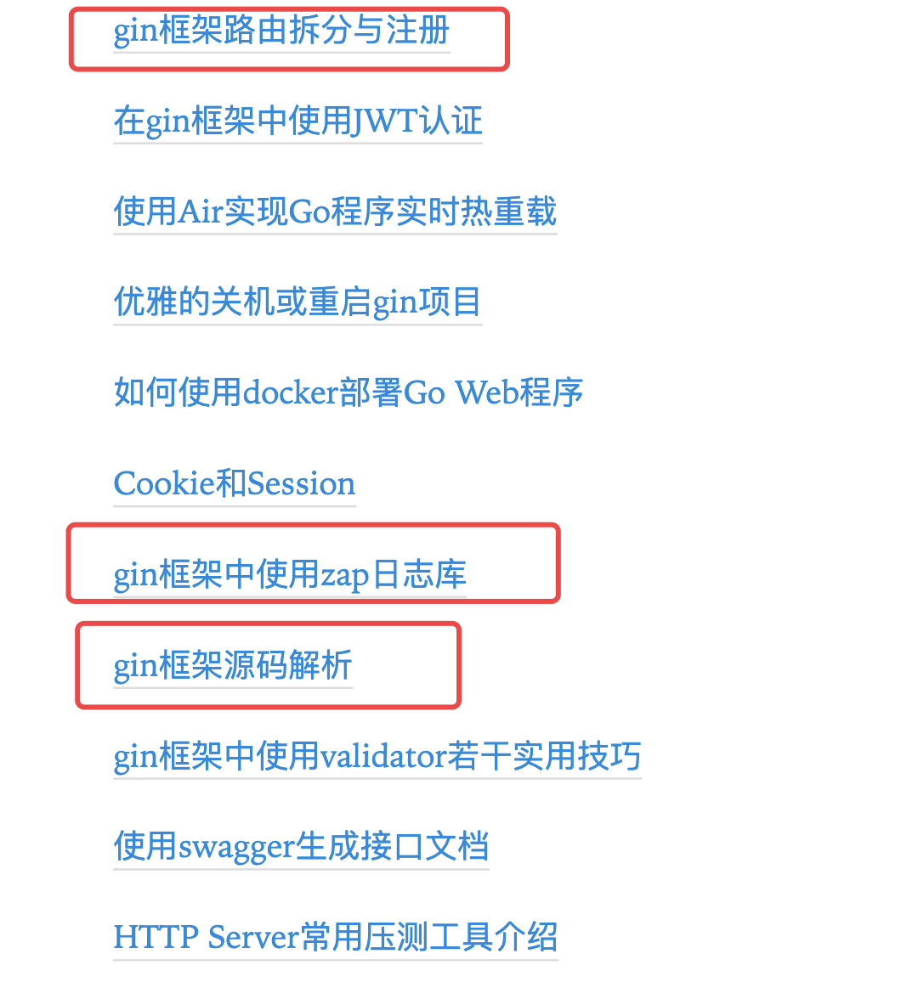

# day11 课上笔记(24人)


## 内容回顾

### 处理并发的错误

goroutine里面如何做错误处理

#### 如何recover goroutine中可能出现的panic

panic只能触发当前goroutine中的recover

#### errgroup 

1. sync.Waitgroup
2. err传递机制;能够把goroutine中的错误接收到（只保留第一个err）
3. 基于context的取消机制

### database/sql

1. 驱动，因为使用的是匿名导入（不直接使用这个包但是会执行这个包的init函数）

   ```go
   import _ "github.com/go-sql-driver/mysql"
   ```

2. dsn ;`sql.Open`不会真正连接数据库
3. db.Close() 要在错误检查后调用；以此类推其他场景也应该如此。
4. 默认自带连接池；
   1. 设置最大连接数
   2. 设置最大空闲连接数
   3. 设置连接时间等...
5. 增删改查
   1. 查单行的时候一定不要忘了确保QueryRow之后调用Scan方法，否则持有的数据库链接不会被释放
   2. 查多行的时候要 rows.Close
6. 事务操作

### sqlx

1. 在 database/sql 之上提供了更加简洁的查询功能
2. namedExec 


### 补充

1. github 如何查资料
2. 多主动看一下源码


## 今日内容

### redis

https://www.liwenzhou.com/posts/Go/go_redis/


像redis这种工具类软件，如果目前还没有在工作中使用过，那你就先想办法把它用起来。

没必要非得一上来就系统地学习，先用起来，简单的命令用起来。

学redis主要是学习常用数据结构的命令：https://www.redis.com.cn/commands.html。

### 准备redis环境

推荐使用docker快速起一个环境


### 驱动包

目前社区里用的比较多的是 redigo 和 go-redis

我推荐使用`go-redis`，目前最新的是v8版本

```bash
go get github.com/go-redis/redis/v8
```


### go-redis使用


#### 连接redis

基本连接模式

```go
func initClient() (err error) {
	// 此处应该是初始化全局的redis连接对象
	rdb = redis.NewClient(&redis.Options{
		Addr: "127.0.0.1:6379",
		// 下面那都是默认值
		Password: "", // no password set
		DB:       0,  // use default DB

		PoolSize: 100, // 连接池大小
	})

	ctx, cancel := context.WithTimeout(context.Background(), 500*time.Millisecond)
	defer cancel()

	_, err = rdb.Ping(ctx).Result()
	return err
}
```

此外还有 cluster 模式、sentinel模式、ring模式

https://redis.uptrace.dev/guide/hll.html

TLS模式




#### .Err()  .Result()  .Val()

```go
func demo1() {
	ctx, cancel := context.WithTimeout(context.Background(), 500*time.Millisecond)
	defer cancel()
	// 设置值 类的命令一般用 Err()
	err := rdb.Set(ctx, "name", "wuyong", 10*time.Second).Err()
	fmt.Println(err)

	// 获取值 类的命令后面一般用 Result()
	v, err := rdb.Get(context.Background(), "name").Result()
	if err != nil {
		// 排除掉key不存在的场景
		if err == redis.Nil {
			// 返回的err是key不存在时...
		}
		fmt.Println(err)
		return
	}
	fmt.Println(v, err)

	// 我只想用value,如果出错了就用默认值
	fmt.Println("------")
	fmt.Printf("Err()==redis.Nil:%#v\n", rdb.Get(context.Background(), "namexxxxx").Err() == redis.Nil)
	fmt.Printf("Err()==nil:%#v\n", rdb.Get(context.Background(), "namexxxxx").Err() == nil)
	fmt.Printf("Val():%#v\n", rdb.Get(context.Background(), "namexxxxx").Val())
	nv, nerr := rdb.Get(context.Background(), "namexxxxx").Result()
	fmt.Printf("Result():%#v %#v\n", nv, nerr)
}
```

#### 万能do命令

```go
val, err := rdb.Do(ctx, "get", "key").Result()
if err != nil {
	if err == redis.Nil {
		fmt.Println("key does not exists")
		return
	}
	panic(err)
}
fmt.Println(val.(string))
```

#### redis.Nil 

查询redis操作会返回err错误，返回错误有两种情况

1. 查询本身出错了
2. 查的key不存在，redis.Nil 就是redis包定义的 key不存在的err


### pipiline

节省RTT



#### redis事务


### gin框架

https://www.liwenzhou.com/posts/Go/Gin_framework/


#### 按请求方法注册路由

GET POST 。。。 Any


#### 返回响应

c.JSON

c.XML


#### 参数获取

1. URL query参数
2. form参数，post表单参数
3. json格式
4. param参数

#### 更方便的获取参数方式 c.ShouldBind()

注意：

1. 字段首字母大写，并且tag要对应上
2. 要传指针类型


### 小清单例子


## 今日作业

1. 把redis的zeset简单实现一个类似微博热搜排行榜的例子
2. 写一个web版登陆功能， form表单提交或者postman 提交json格式数据，gin框架里面查询mysql数据库返回用户名密码是否正确，正确就返回欢迎，斗否则返回用户名或密码错误。


## 下周内容



## 今日分享


当你迷茫的时候就专注当下多赚钱。


