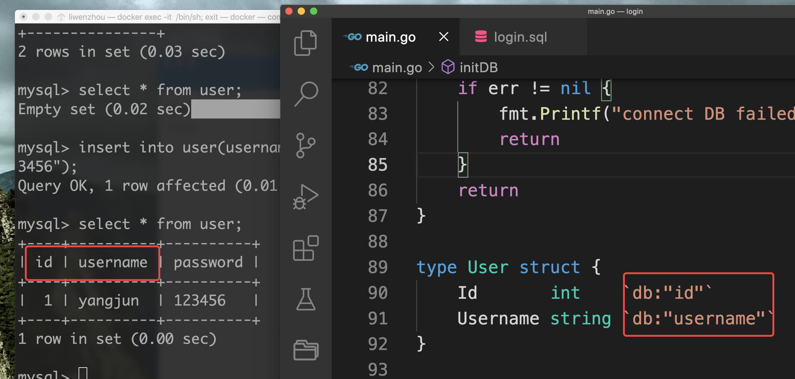
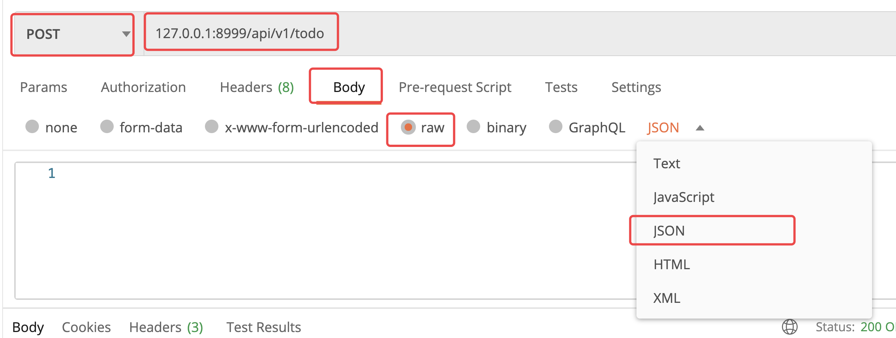
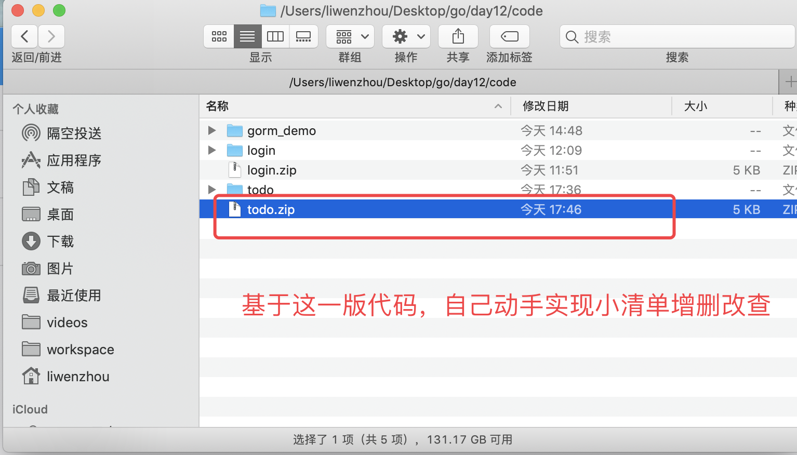

#  n day12课上笔记(24人)


## 内容回顾

### redis

https://www.liwenzhou.com/posts/Go/redis/

### gin

https://www.liwenzhou.com/posts/Go/Gin_framework/

### 登录作业

写一个web版登陆功能， form表单提交 或者postman 提交json格式数据，gin框架里面查询mysql数据库返回用户名密码是否正确，正确就返回欢迎，否则返回用户名或密码错误。





### 补充 JSON操作的奇淫巧技

https://www.liwenzhou.com/posts/Go/json_tricks_in_go/


## 今日内容

### GROM

https://gorm.io/

https://gorm.io/zh_CN/docs/index.html


### 小清单练习

使用docker启动一个mysql client端去连接mysql server

```bash
docker run -it --network host --rm mysql:8.0.19 mysql  --default-character-set=utf8mb4 -h127.0.0.1 -P13306 -uroot -p
```





## 本周作业


