# day13课上笔记(25)


## 内容回顾

### 小清单项目示例

#### 技术点

- gin 框架
- mysql + gorm
- vue -> 前后端分离的项目

#### 做业务开发的套路

1. 获取参数

   1. 各式各样的参数获取方式（query参数、form表单、JSON、path参数）
   2. 参数校验

2. 业务逻辑处理

   1. 拆解需求去实现
   2. logic(service)层  -> dao层

3. 返回响应

   1. 跟对方约定好返回响应的格式

      ```json
      {
        "code": 0,
        "msg": "操作成功",
        "err": "",
        "data": [
          {"title": "吃饭", "status": false},
          {"title": "睡觉", "status": true}
        ],
      }
      ```

      

## 今日内容

### gin框架源码解析（了解为主）

https://www.liwenzhou.com/posts/Go/read_gin_sourcecode/

了解 gin 框架的工作流程

- 怎么处理请求
- 怎么注册路由的
- 内部路由的结构/原理
- 中间件的执行流程


#### gin框架如何处理请求,

gin框架什么时候参与到了HTTP请求的处理

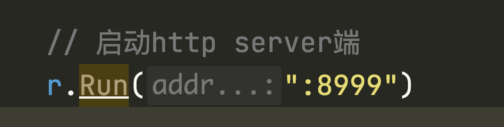


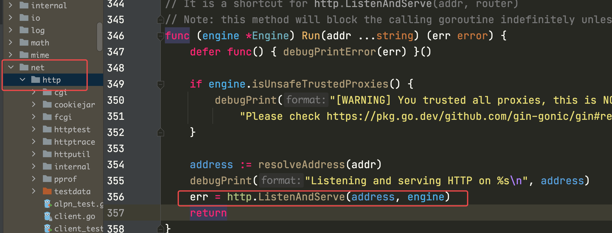


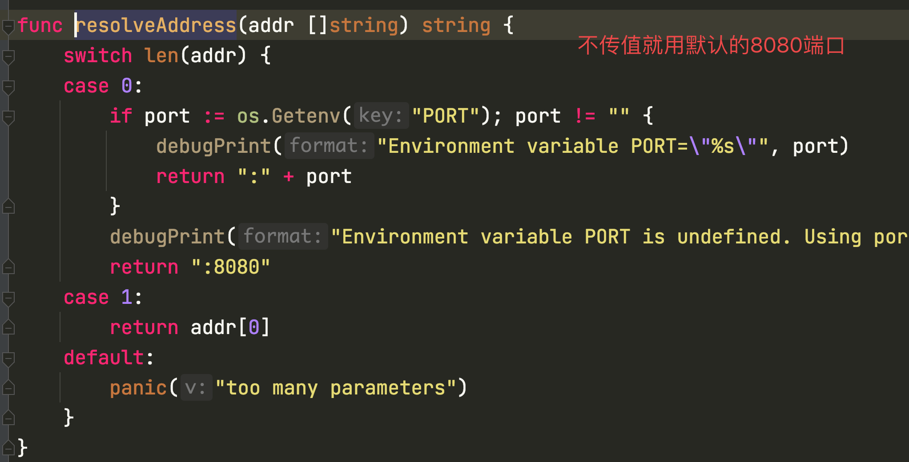


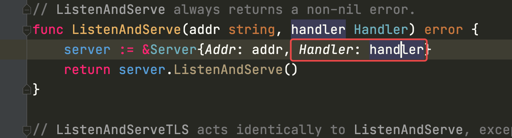


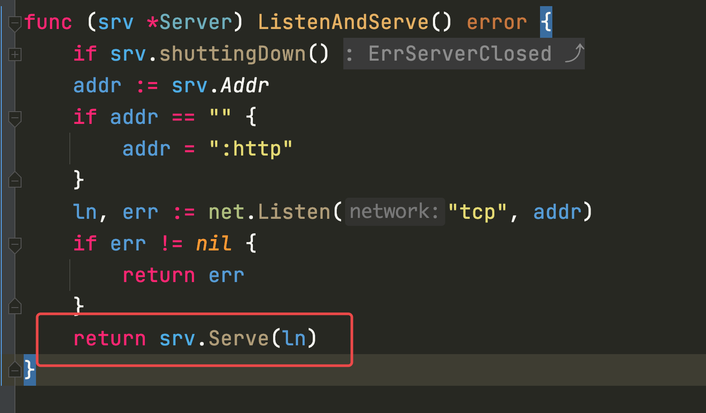


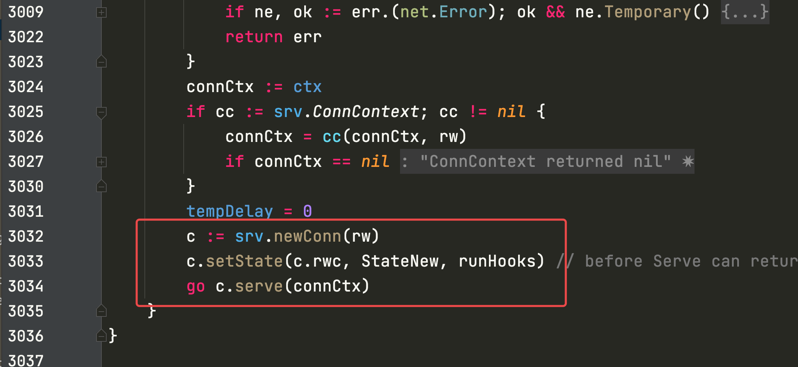


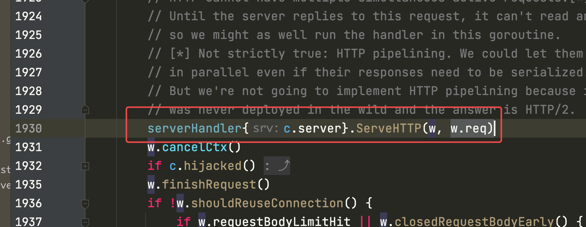


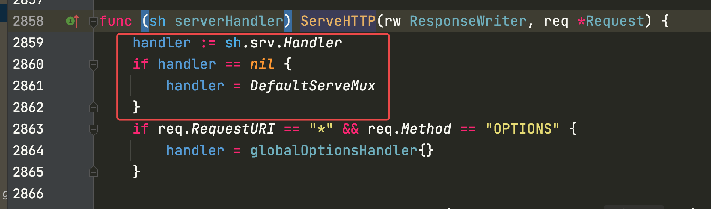

sh.srv是谁？↓

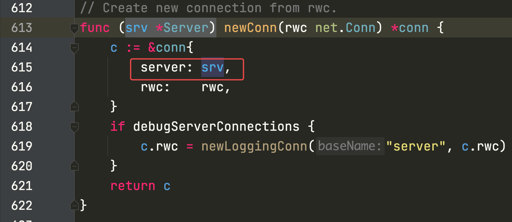


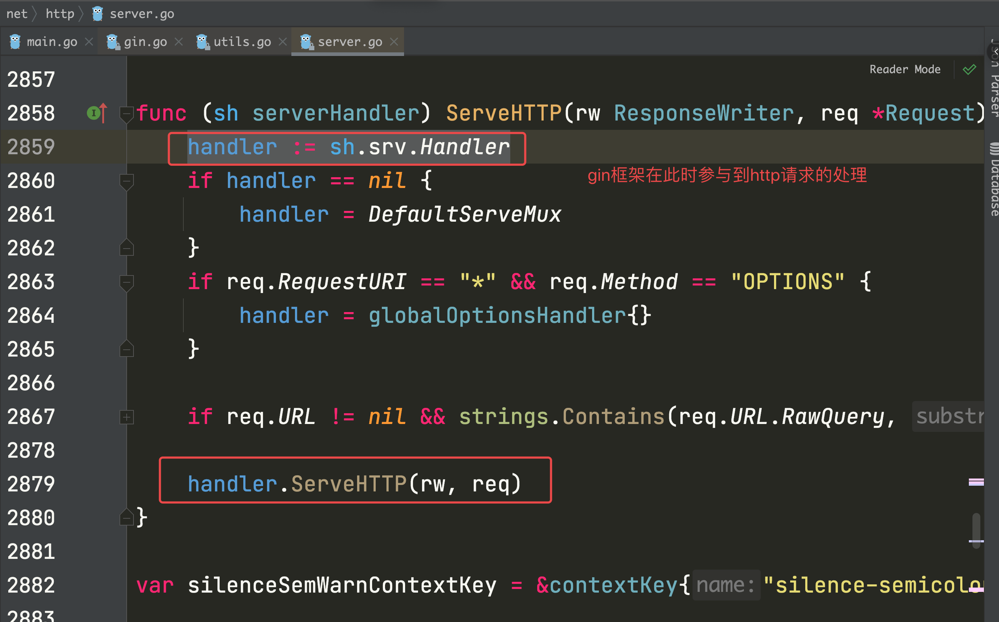


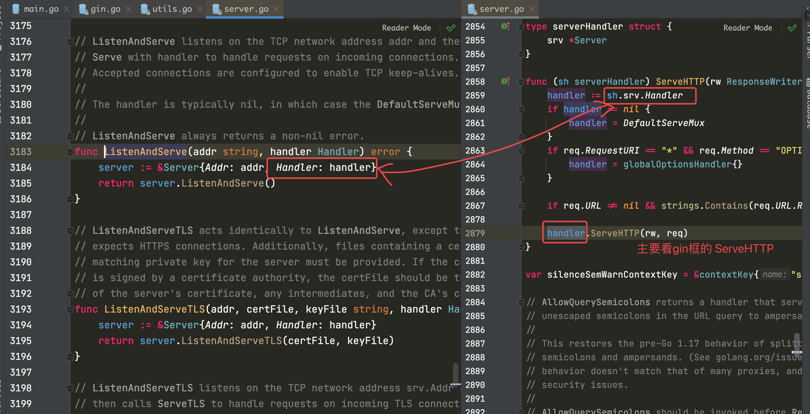


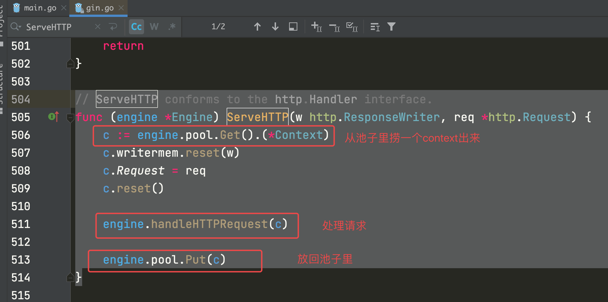


gin框架本质上就是实现一个路由器的功能

- 根据请求的**方法**和**URI** 去找到 **对应的函数** 执行


#### 路由注册

构造前缀树的过程

合并路由组的处理函数

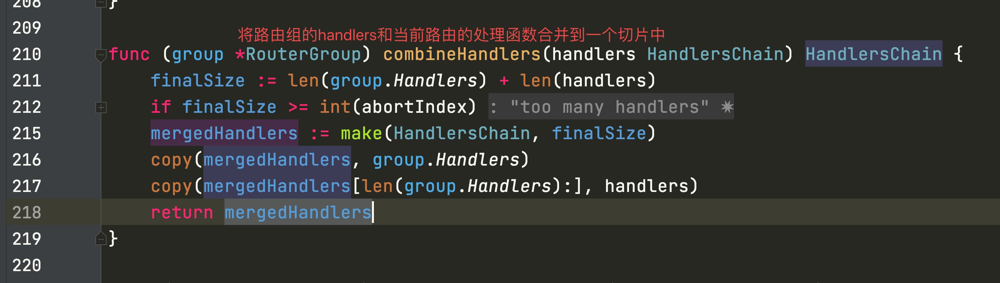

```go
make([]int, 2)  // [0 0]

make([]int, 0, 2)  // []
```


#### 路由查找

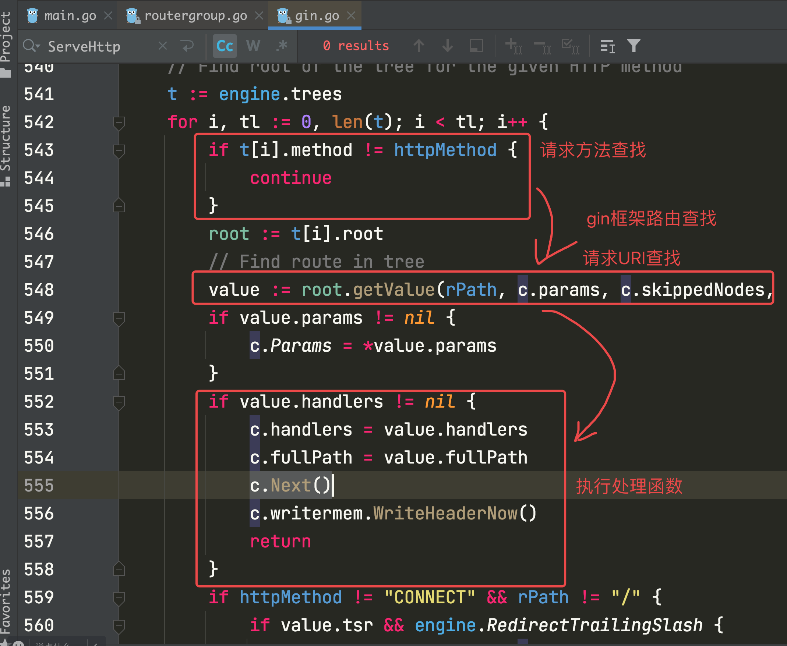


请求处理函数链条的执行顺序：

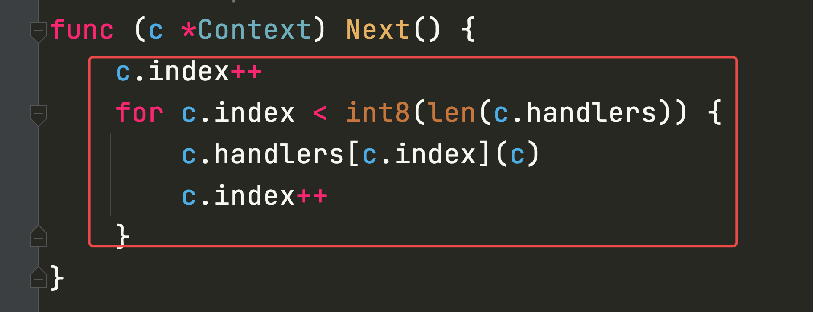


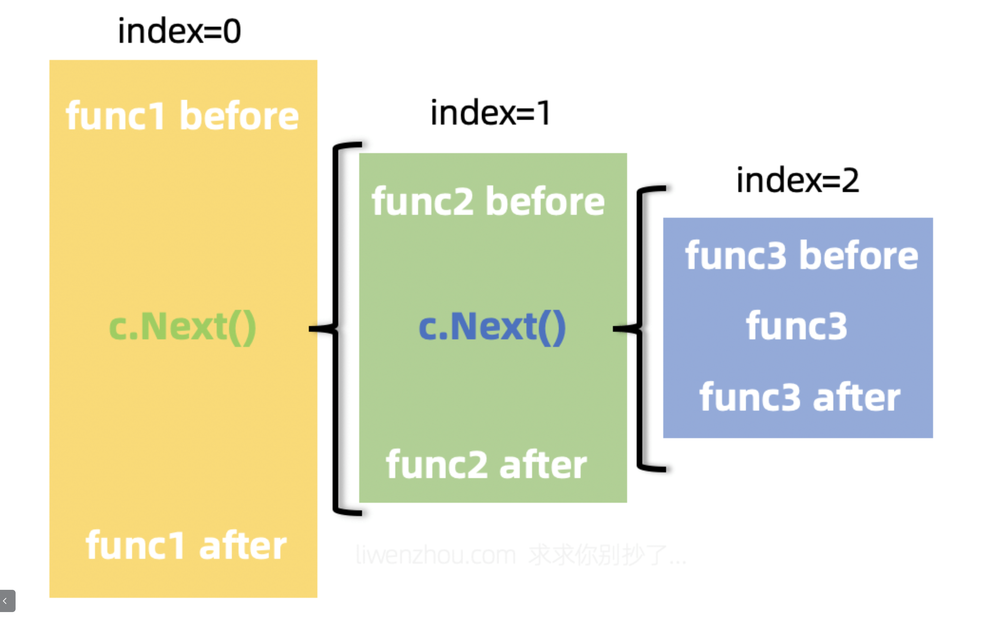


c对象是贯穿该次请求流程的一个对象。

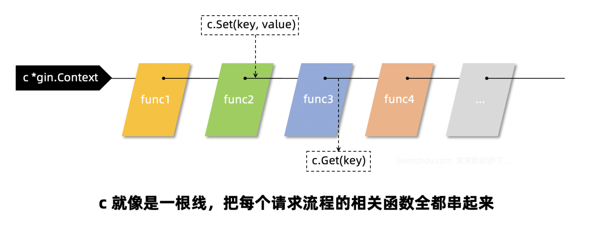


### gorm更新的注意事项

```go
db.Debug().
		Model(&Book{}).
		Updates(Book{Title: "hello", Amount: 18, Status: false})
```

相当于执行：

```sql
UPDATE `books` SET `updated_at`='2022-04-10 15:22:02.061',`title`='hello',`amount`=18 WHERE `books`.`deleted_at` IS NULL
```


```go
var id uint = 1
	var b1 Book
	err := db.Where("id = ?", id).First(&b1).Error // 先查一条记录（包含主键）
	if errors.Is(err, gorm.ErrRecordNotFound) {
		fmt.Println("参数错误")
	}
 // 如果数据库中当前状态已经是要变更的状态就直接返回成功，没有必要继续执行下去
 // ...

	db.Debug().
		Model(&b1).
		Updates(Book{Title: "hello2", Amount: 28, Status: false})
```

相当于执行：

```sql
UPDATE `books` SET `updated_at`='2022-04-10 15:27:51.133',`title`='hello2',`amount`=28 WHERE `books`.`deleted_at` IS NULL AND `id` = 1
```


```go
db.Debug().
		Where(&Book{Model: gorm.Model{ID: id}}).
		Updates(Book{Title: "hello3", Amount: 38, Status: false})
```

相当于执行：

```sql
UPDATE `books` SET `updated_at`='2022-04-10 15:33:52.484',`title`='hello3',`amount`=38 WHERE `books`.`id` = 1 AND `books`.`deleted_at` IS NULL
```


### jwt 认证

https://www.liwenzhou.com/posts/Go/jwt_in_gin/

#### Cookie和Session模式

前后端不分离的场景下使用比较多

#### token模式

JWT(json web token)

分为两部分：

1. 生成token
2. 对token进行校验
   1. 判断token是否有效
   2. 能从token中获取需要的数据


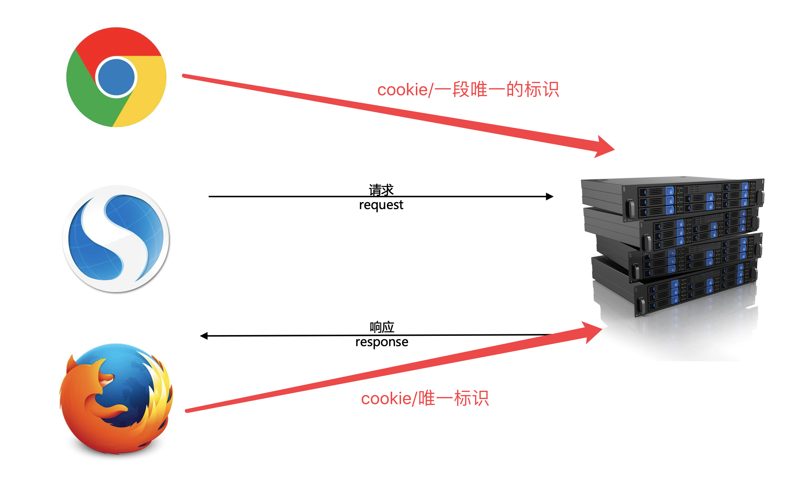


#### 扫码登录


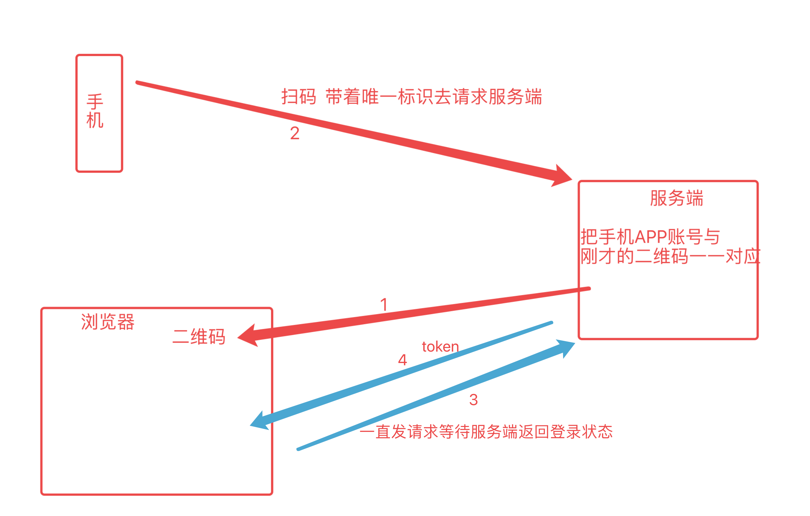


### validate校验


### zap日志库


## 本周作业


