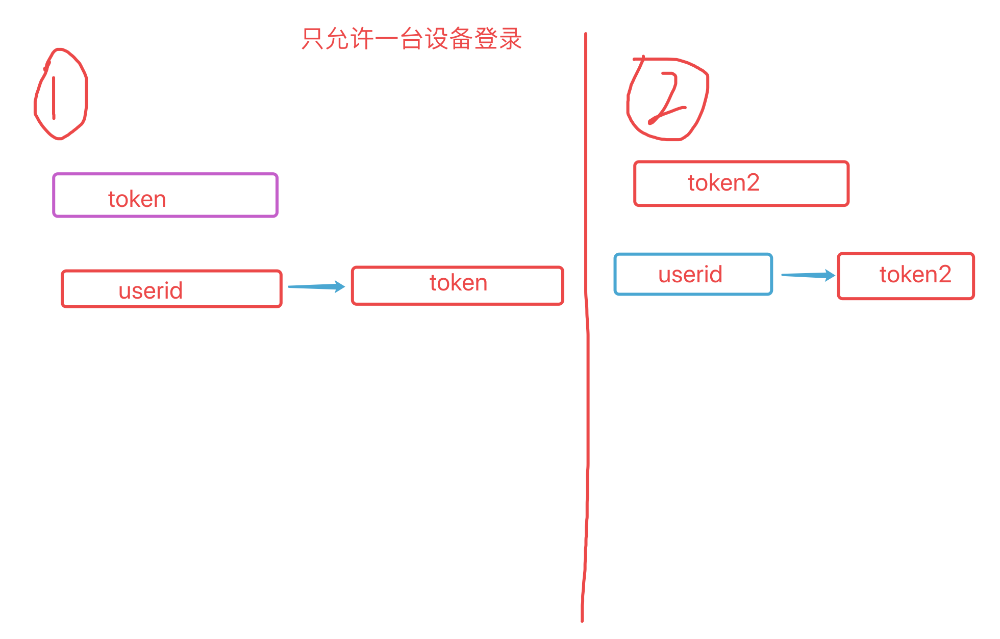
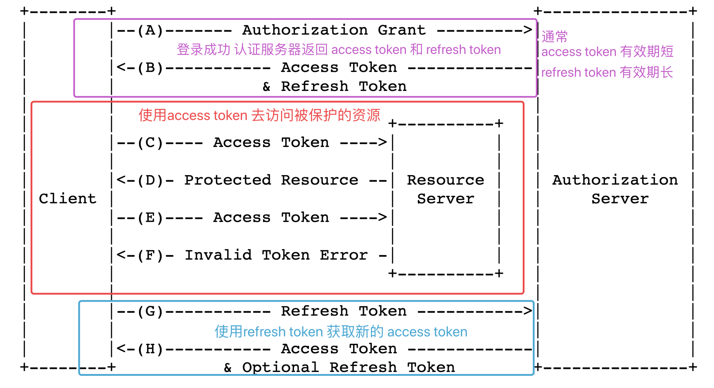
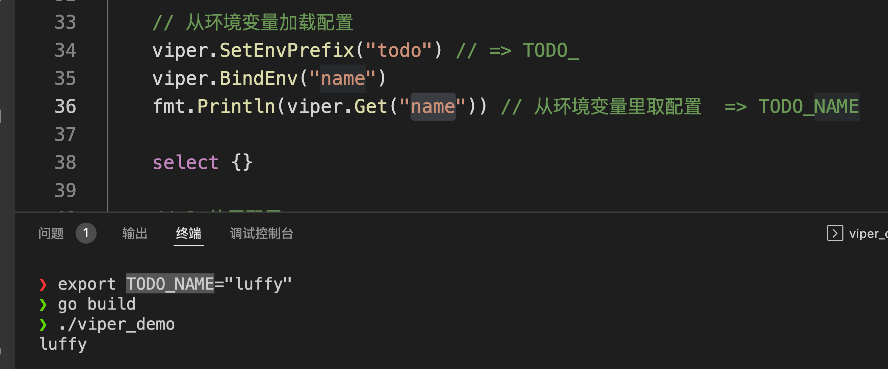
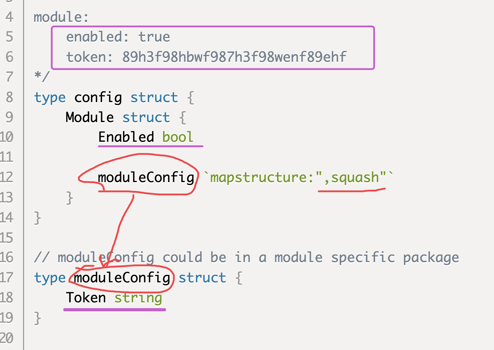

# day14课上笔记(23人)


## 内容回顾

### gin框架参数校验

对应 `int`、`string`、`bool` 这几种数据类型，如何区分不传值和传零值？

```go
type employee struct {
  Name string
  UUID int
  IsMarried bool `json:"isMarried" binding:"required"`
}
```

在使用gin框架默认的的binding做校验的时候，该怎么区分没传值默认为false还是没结婚就是false？

```go
var x = employee{}

var y = employee{Name:"杨俊", UUID: 1234, IsMarried:false}

x.IsMarried = ?  // false
y.IsMarried = ?  // false
```

用`*bool` 指针类型，因为指针默认零值是`nil`, 只要传值就是不是 nil

```go
type employee struct {
  Name string
  UUID int
  IsMarried *bool `json:"isMarried" binding:"required"`
}
```

除了参数校验的场景还有数据库入库的场景也有类似的问题。

除了用上面提到的指针类型还可以是使用sql包中提供的

```go
sql.NullBool
sql.NullTime
sql.NullString
// ...
```


### 使用ORM工具

1. 定义结构体/class => 与数据库里的一张表对应

   ```go
   type User struct {
     ID           uint
     Name         string
     Email        *string
     Age          uint8
     Birthday     *time.Time
     MemberNumber sql.NullString
     ActivatedAt  sql.NullTime
     CreatedAt    time.Time
     UpdatedAt    time.Time
   }
   ```

   `user = User{ID:1}`

2. 使用结构体对象对应数据库的一条记录，做增删改查

   

### GORM更新（update）的坑

```go
db.Model(&user).Update("name", "hello")
```

其中`user`结构体必须包含主键。

如果不包含主键，就会变成更新表里所有的数据。

如果事先没有一个包含主键的结构体，想要去更新一条记录应该用`Where("username = ?", "张三")`指定查询条件。

### JWT

概念：是一个 token ,  **J**SON **W**eb **T**oken

https://www.ruanyifeng.com/blog/2018/07/json_web_token-tutorial.html


#### 限制单设备登录




#### refresh token

OAUTH2.0关于刷新token文档： https://datatracker.ietf.org/doc/html/rfc6749#section-1.5




## 今日内容

### validator参数校验

博客：https://www.liwenzhou.com/posts/Go/validator_usages/

官方文档：https://pkg.go.dev/github.com/go-playground/validator#pkg-overview

做业务开发的三板斧：

1. 参数处理
   1. 获取参数
      1. query参数 ?name=张三
      2. form表单
      3. json
      4. path 路径参数
   2. 参数校验  --> `validator`
2. 业务逻辑
3. 返回响应

gin框架默认用的就是validator做参数校验。


https://pkg.go.dev/github.com/go-playground/validator#pkg-overview


#### 原理

就是利用反射去结构体字段找规则，对每个字段的值按规则进行校验。

你写一个包，让别人用。你在文档里告诉别人结构体字段里要用`aping` 作为tag.

```go
type data struct {
  ID int `aping:"id"`
}
```

#### 定制化操作

翻译

自定义结构体级别的校验方法

自定义字段级别的校验方法

#### 单独使用 validator 做结构体数据校验

```go
type Data struct {
	Email string `validate:"required,email"`
	Phone string `validate:"required"`
}

func f1() {
	// 声明一个校验器对象
	v := validator.New()
	su := Data{
		Email: "xxx",
	}
	// 针对v做定制化的操作，比如翻译、自定义校验规则...
	// 对结构体的字段进行校验
	err := v.Struct(&su)
	fmt.Println(err)
}
```

### viper 配置文件加载

https://www.liwenzhou.com/posts/Go/viper_tutorial/

配置文件加载：

1. 主流的配置文件格式：toml、yaml、json、xml、ini（conf、properties）
2. 配置的来源：文本文件、环境变量、配置中心（携程开源的apollo配置中心、nacos）
3. 支持配置热加载








go-ini 配置文件解析。


### zap 日志库

https://www.liwenzhou.com/posts/Go/zap/


### 

搭个比较通用架子


## 本周作业

1. 程康华（华仔）写小清单前端页面（登录注册、路由拦截、自动refresh token），写完发给大家。
2. 课上的代码 validator和viper的例子写一遍
3. 小清单中数据库的配置就用yaml配置文件，使用viper从配置文件加载配置。

