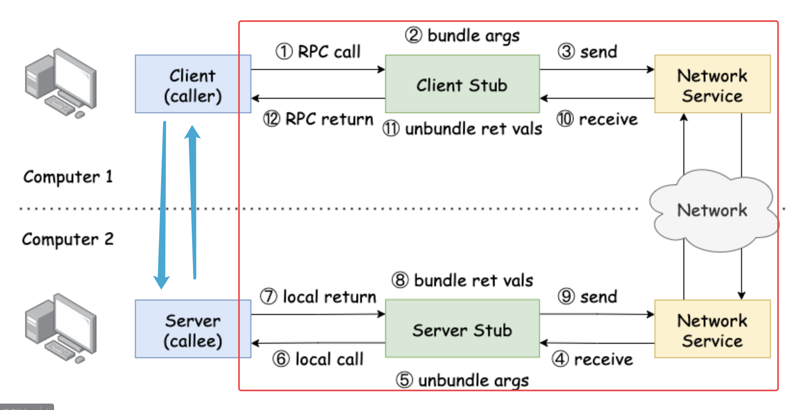
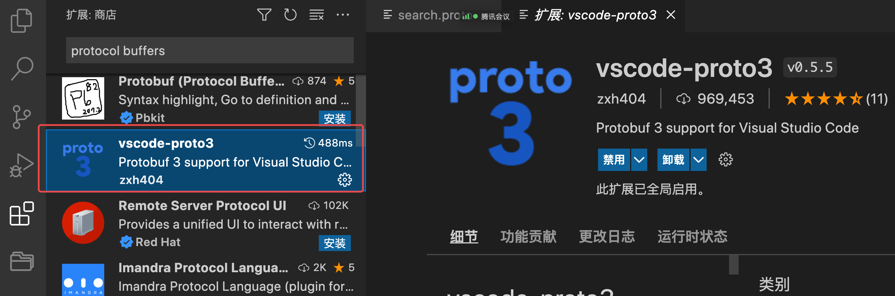
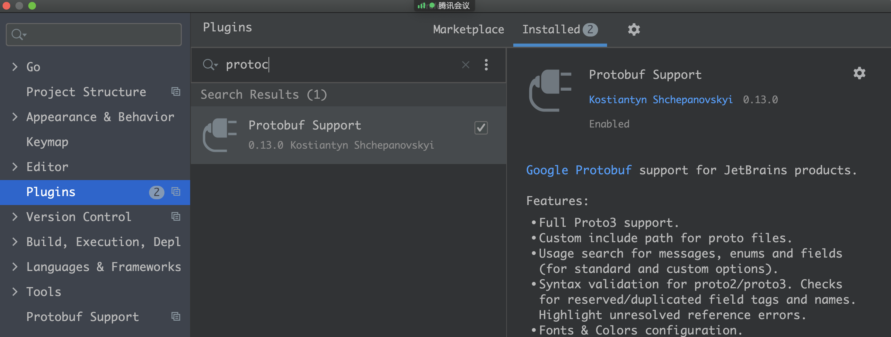
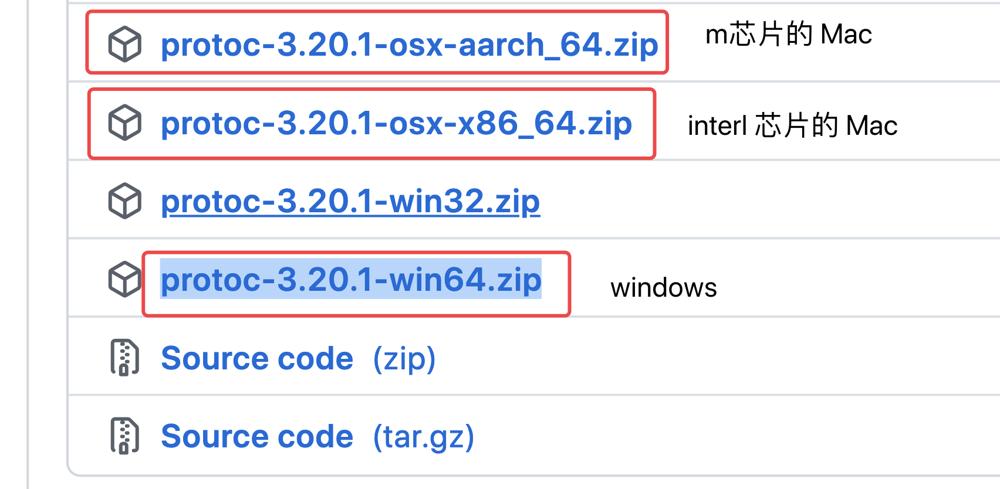
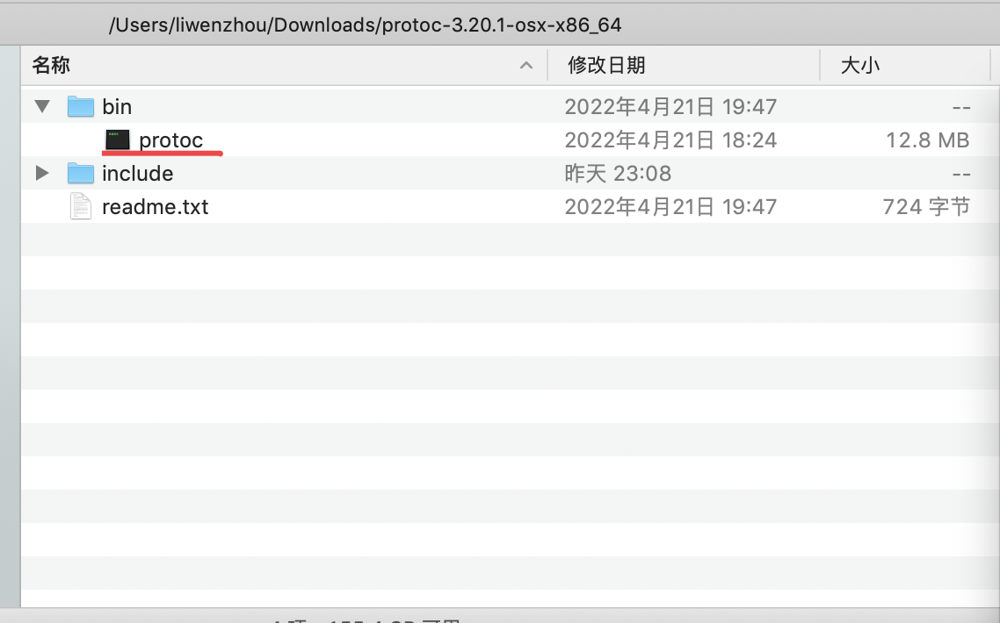
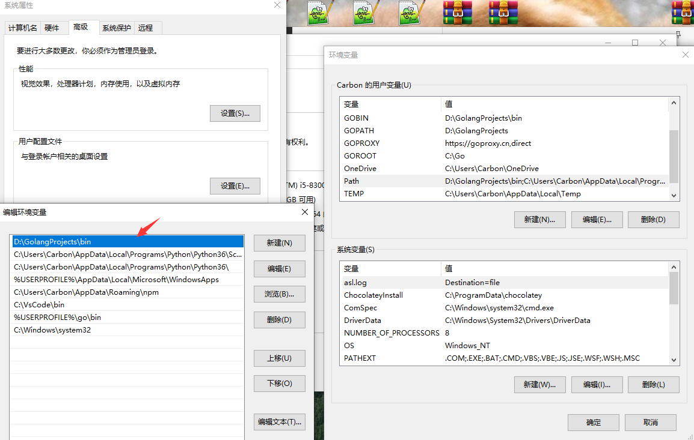
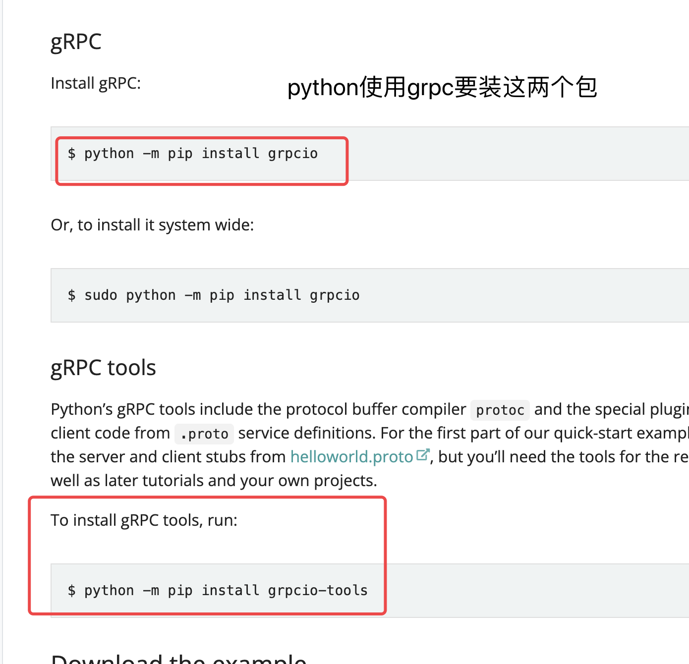

# day16课上笔记(21人)


## 内容回顾

### 课前问题答疑

安小枫：项目下导入包的问题

程康华：一系列问题

### 上周内容

##### 日志的必要性

1. 作为一个开发要学会记录日志，把代码流程中一些关键节点的信息记录下来，方便后续查问题。
2. 现在企业内部基本都会配置日志收集系统，把每个服务器或者容器节点的日志汇总到一起。
3. 例如，通过一个订单号就能把该订单相关的日志都查出来。
   1. 代码中要输出日志，输出的日志中要记录订单号和其他一切必要信息。
   2. 输出日志格式要支持日志收集，json格式。
   3. EFK（Elasticsearch Filebeat Kibana）
      1. Filebeat ：agent部署到每台机器上
      2. Elasticsearch ：开源搜索引擎
      3. Kibana：管理界面
   4. K8s部署的项目有的直接将日志输出到终端（os.Stdout）；有的是挂载文件磁盘记录到日志文件中


##### zap日志库

zap日志库

1. 简单应用，使用默认的配置生成一个logger对象，记录日志
2. 记录日志是通过一系列的方法：
   1. logger.Debug()
   2. logger.Info(“日志消息”, zap.Int64("orderId", 1876622005), ...)
   3. logger.Warn()
   4. logger.Error()

3. zap使用的时候，需要为日志的每个字段指定类型。

**自定义的配置**

1. 输出位置
   1. 输出到标准输出
   2. 输出到文件
   3. 同时输出到标准输出和文件
2. 编码
   1. json格式
   2. 文本格式
   3. 自定义字段名称
   4. 自定义时间格式化
3. 日志级别
   1. Level: Error > Warn > Info > Debug
   2. 为什么要设置日志级别

**补充配置**

1. 正常记录日志的同时将 error 日志额外记录到一个 xx.err.log 文件中  --> NewTee() 把两个core合并成一个core
2. 添加调用栈信息 AddCaller()
3. zap.ReplaceGlobalLogger()  --> 替换zap库中全局的logger

##### **日志切割**

为什么切割

1. 程序一直运行，日志文件越写越大，占用磁盘空间
2. 日志文件太大不方便查问题。

切割方式

1. 一种是外部切割，使用系统工具（logrotate）或自己编写脚本对日志文件进行切割
2. 记录日志的时候切割，zap+插件的方式

切割的策略

1. 按时间切割：业务量大就按小时切割，业务量小就按天切割。app.log -> app.log.2022051514
2. 按文件大小切割：日志文件大小超过400M就切割。 app.log -> app.log.1
3. 指定备份数量

##### **gin框架集成zap**

将zap集成到两个中间件中

1. logger()中间件
2. recover()中间件

##### **搭建常用的web开发脚手架**

gin + zap + viper 

##### **常见的web开发分层结构**

CLD（controller + Logic + Dao）分层


## 今日内容

### RPC

https://www.liwenzhou.com/posts/Go/rpc/

远程过程调用，区别于本地调用。


#### 为什么要用RPC调用？

1. 分布式的应用
2. 大的单体应用进行微服务拆分，一个业务流程就会涉及到很多的机器上的很多服务。
3. 服务A调用服务B，通过REStful API调用的效率比较低
4. 微服务场景下大家一般都用RPC调用。


#### RPC调用是什么

机器A上某个程序直接调用机器B上某个程序的函数。


#### RPC要解决的问题

1. 怎么连接到其他的电脑（机器、容器。。。）？

2. 怎么跨内存空间找到要调用的函数？ 

3. 跨语言的调用传输过程中怎么处理数据？ 

#### RESTful API

1. 通过TCP 连接
2.  /add -> addHanlder -> add()
3. HTTP协议 + JSON


#### RPC的原理




上午的内容

RPC的原理

基于 net/rpc 一步一步实现RPC调用

RPC（远程过程调用）调用的核心：

1. 通过网络连接到另外一个服务
2. 怎么样确定要调用的函数（方法）
3. 函数/方法有参数和返回值数据，如何做编码


### protobuf（全称protocol buffers）

官网：https://developers.google.com/protocol-buffers 

https://developers.google.cn/protocol-buffers/docs/proto3

翻译版：https://colobu.com/2017/03/16/Protobuf3-language-guide/


目前主流的编码协议，大部分语言都支持。

是二进制的协议，性能好。

类似于XML,但是比XML更小、更快。


Vscode 安装 protobuf 语法插件：



Goland 也有类似的插件，不同版本的Goland可能会不一样，大家自己搜一下。




JSON:

```json
{"name": "杨俊", "age": 18, "score": 60}
```

protobuf 类似于:

```protobuf
1:杨俊2:183:60
```


### protobuf工作模式

1. 大家定义好 `.proto` 源文件

2. 根据源文件生成各种语言的代码


### protobuf语法的特点

1. 每一行需要用`;`结尾
2. 类型在前
3. 每个字段有独一无二的编号


### protobuf 语法

1. message
   1. reserved
   2. 嵌套
2. enum
   1. reserved
3. import导入
4. Any
5. oneof
6. map


需要安装的

protoc ：解析proto文件用的

- Mac Intel芯片 64位：https://github.com/protocolbuffers/protobuf/releases/download/v3.20.1/protoc-3.20.1-osx-x86_64.zip

protoc-gen-go：生成go语言要用的插件

```
go install google.golang.org/protobuf/cmd/protoc-gen-go@v1.28

-------------------------GOPATH 路径要加入到环境变量里
kanghuadeMacBook-Pro:protobuf_demo kanghua$ go env |grep GOPATH
GOPATH="/Users/kanghua/go"
```


### grpc

目前主流的RPC框架

https://www.liwenzhou.com/posts/Go/gRPC/


HTTP/2 相比 1.0 有哪些重大改进？https://www.zhihu.com/question/34074946

### 安装

#### 安装gRPC

```bash
go get -u google.golang.org/grpc
```


#### 安装 protocol buffers v3    

https://github.com/protocolbuffers/protobuf/releases/tag/v3.20.1 

Windows 64位：https://github.com/protocolbuffers/protobuf/releases/download/v3.20.1/protoc-3.20.1-win64.zip

Mac Intel芯片 64位：https://github.com/protocolbuffers/protobuf/releases/download/v3.20.1/protoc-3.20.1-osx-x86_64.zip

Mac Apple芯片 64位：https://github.com/protocolbuffers/protobuf/releases/download/v3.20.1/protoc-3.20.1-osx-aarch_64.zip




解压之后，会得到如下文件：



Windows 平台是`bin/protoc.exe` 文件

##### 添加环境变量

**把下载的 `protoc-3.20.1-osx-x86_64/bin` 目录添加到你的环境变量中！**

```bash
❯ protoc --version
libprotoc 3.20.1
```

Mac系统`vim ~/.bash_profile`使用export添加环境变量


Windows系统添加环境变量




**配置完环境变量后记得重启一下已经打开的终端。！！！**


### 安装 protoc-gen-go

```bash
go install google.golang.org/protobuf/cmd/protoc-gen-go@v1.28
```

### 安装protoc-gen-go-grpc

```bash
go install google.golang.org/grpc/cmd/protoc-gen-go-grpc@v1.2
```





## 本周作业

把课上的例子自己敲一遍。

重点关注：RPC的原理、protocol buffers 的语法、grpc的开发方式


下周内容：下周内容：gRPC进阶 服务注册与服务发现


## 今日分享

**知道**和**做到**之间隔了很远很远。

希望大家都能成为知行合一的人。

