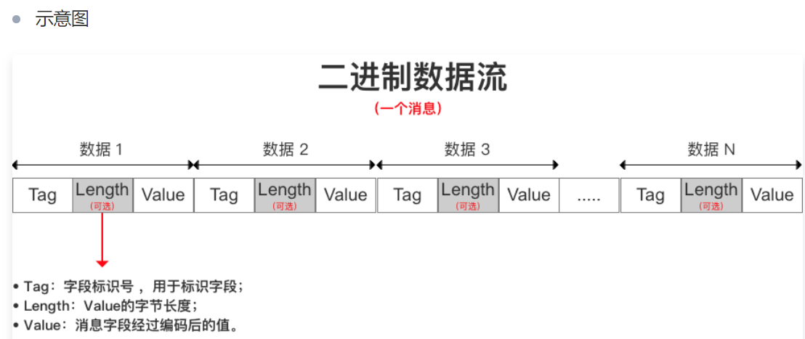
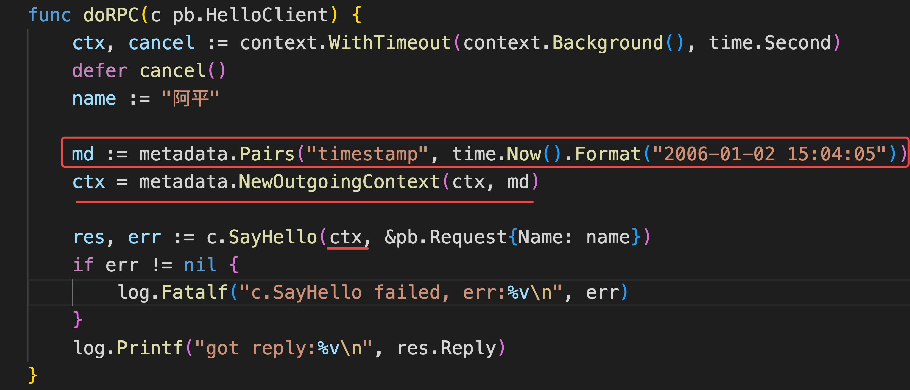
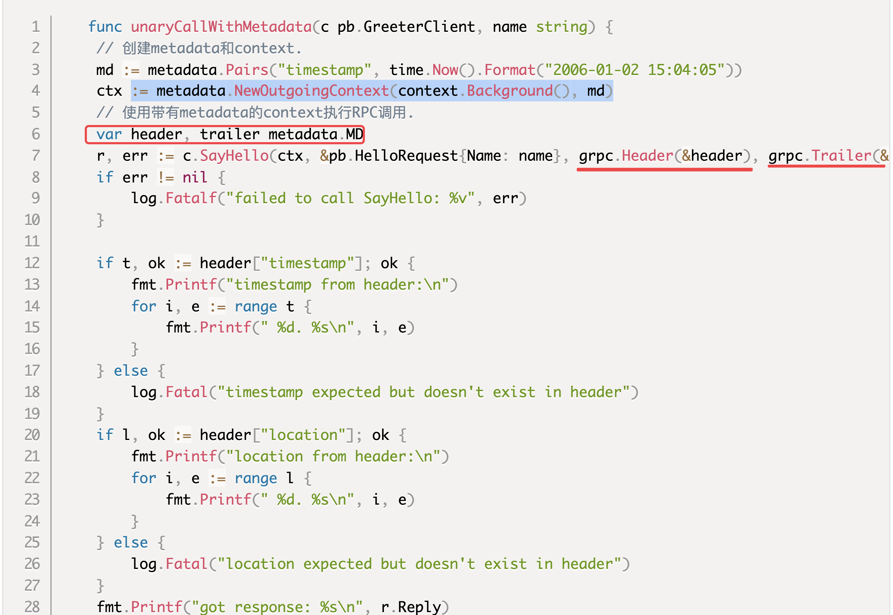
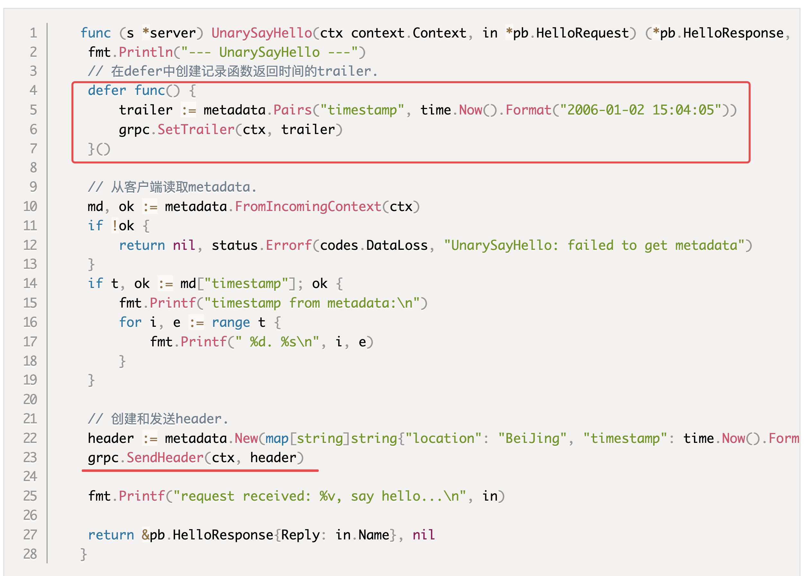
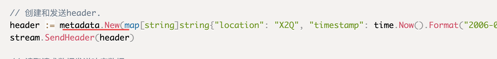
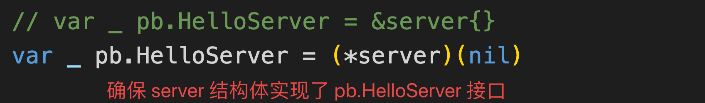
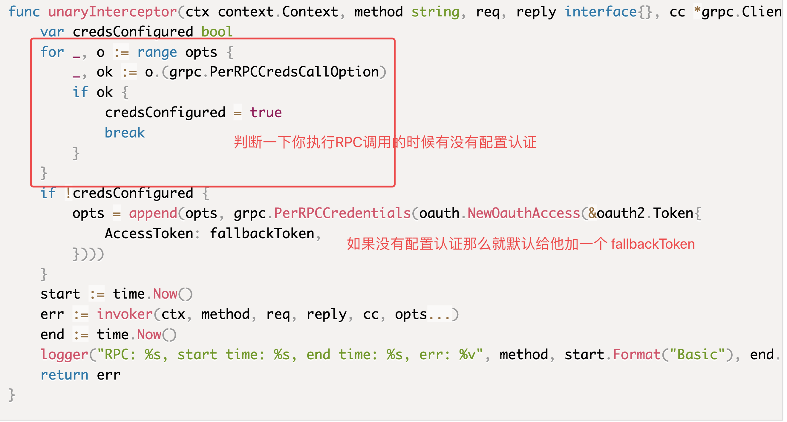
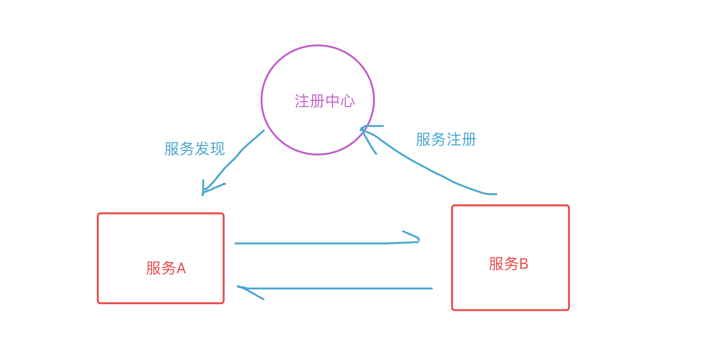

# day17课上笔记（18人）


## 课前答疑（程康华专场）

1. go gin 后台实现登录返回验证码功能
   1. 如果没有思路那就把场景复现出来。（需求反讲）
   2. 需求分解
      1. 用户访问登录页面后端返回一个验证码（）
         1. 后端生成随机验证码
         2. 渲染成图片（？）-> 找个Go语言的图片库img
         3. 返回给前端
      2. 使用第三方服务（极验）-> 嵌入SDK

2. 手机验证码
   1. 调用服务商的SDK
   2. 重要操作之前调用一下发短信，等待验证
3. 前端传过来一个用户头像或者文件， go gin后端代码如何写，（用户头像 限制png jgeg 格式，大小不超过500kb）包括前端登录访问时候后端返回头像图片。
   1. gin框架上传文件，后端保存（gin框架那一节有说）
      1. 保存在自己服务器上  --> 自己维护静态文件连接 ，保证URL能正常访问 -> 存到数据库中（用户头像）
      2. 保存在别的服务器上（oss\cdn） --> 外部可访问的URL -> 存到数据库中（用户头像）--> 如何防刷？url加验证参数
   2.  限制 png jgeg 格式和大小
      1. 前端要做check
      2. 后端做check
         1. 拿到文件的信息做check
   3. 前端登录访问时候后端返回头像图片
      1. 查库拿到头像的URL，前端作展示


## 内容回顾

### RPC

重点：**理解RPC的原理**

RPC是远程过程调用，区别于本地调用。

要实现 电脑1 调用 电脑2上的函数，要解决的问题。

1. IP+端口+协议在互联网上找到程康华的电脑上的程序
2. 函数名、参数、返回值要通过网络传输
3. 函数名 <--对应-->  程康华程序里的函数

解决了上面三个问题就可以发起RPC调用。

对于开发者来说发起RPC调用和直接调用本地程序最好类似，所以市面上出来很多RPC框架。

RPC框架就是对上面三个步骤做了封装，让我们调用RPC更方便。

基于`net/rpc`标准库，实现RPC调用

- HTTP协议版
- TCP协议版
- 默认gob编码协议
- JSON编码数据版  --> Python不支持gob

### protocol buffers V3

重点：**protobuf V3 语法！！！**

高效、各种语言都支持的协议。

Python obj  --json.dumps-->  JSON协议数据   --json.Unmarshal--> Go map[string]interface{}/struct

`{"name":"qimi", "age":18, "book":"go}`

Python obj --生成的代码里的方法-->  protobuf data二进制数据  --生成代码里的方法 -->Go map[string]interface{}/struct


为什么要生成代码？ 传输的数据不同编解码的代码不一样

qimi18go

数据会被序列化成二进制数据；



数据里面通过编号来区分字段；

要跨语言

`.proto`文件

```protobuf
syntax = "proto3"; // 版本声明，使用Protocol Buffers v3版本

option go_package = "hello_server/pb;pb"; // 指定go package名称；xx通常为你项目的导入路径

package pb; // 包名


// 定义服务
service Greeter {
    // SayHello 方法
    rpc SayHello (HelloRequest) returns (HelloResponse) {}
}

// 请求消息
message HelloRequest {
    string name = 1;
}

// 响应消息
message HelloResponse {
    string reply = 1;  // 1是标号
}
```


#### protoc

用来将 `.proto`文件编译成各种语言的编译器。

`.proto`文件，直接发给其他写微服务的人就行了


### gRPC

重点：**gRPC的使用**

HTTP2

开发步骤

1. 定义`.proto`文件 ,里面定义message和rpc
2. 用两个插件生成代码（安装protoc 和 插件）
   1. 生成go语言代码
      1. message -> struct
      2. rpc -> server端的服务
      3. rpc  -> client端调用方法
   2. 生成gRPC代码
      1. 生成gRPC框架可用的代码

3. 编写业务逻辑的代码


## 今日内容

### import 导入proto文件

导入

```protobuf
import "google/protobuf/timestamp.proto";
```

使用

```protobuf
// 包含问候语的响应消息
message HelloReply {
    string answer = 1;
    google.protobuf.Timestamp ts = 2;
}
```

### gRPC示例

自己动手写一个简单的gRPC服务，并编写客户端调用。

### 流式RPC

1. 服务端流式
2. 客户端流式
3. 双向流式

### metadata

调用方相关的、跟实际业务不相关、所有的请求都会用到的数据，就可以把这一类数据放到 metadata.

```go
import "google.golang.org/grpc/metadata"
```








### 


### 加密和认证

```go
grpc.Dial(":8974", grpc.WithTransportCredentials(insecure.NewCredentials()))
```


### 错误处理

status

```go
import "google.golang.org/grpc/internal/status"
```

codes 定义了grpc里面的错误码

```go
import "google.golang.org/grpc/codes"
```

了解常用的code

status 和 error 之间互相转换。


补充：




[gRPC官方示例](https://github.com/grpc/grpc-go/tree/master/examples/features)


### 拦截器




拦截器分类：

客户端：2种（普通的和流式的）

服务端：2种（普通的和流式的）


补充：

常用的 grpc 中间件

go-grpc-middleware ：https://github.com/grpc-ecosystem/go-grpc-middleware


### consul服务注册与服务发现

为什么需要服务注册与服务发现：https://zhuanlan.zhihu.com/p/161277955





https://www.liwenzhou.com/posts/Go/consul/

###  api注册服务

```go
package main

import (
	"log"

	"github.com/hashicorp/consul/api"
)

// register2Consul 注册服务到consul
func register2Consul() {
	// 1. 连上consul
	cfg := api.DefaultConfig()
	cfg.Address = "10.211.55.6:8500"
	client, err := api.NewClient(cfg)
	if err != nil {
		log.Fatalf("api.NewClient failed, err:%v\n", err)
	}
	// 2. 服务注册()
	srv := &api.AgentServiceRegistration{
		ID:      "hello-127.0.0.1-8974", // 服务名称-ip-端口
		Name:    "hello",
		Tags:    []string{"Beijing-hello", "hello", "q1mi"},
		Address: "127.0.0.1",
		Port:    8974,
	}
	client.Agent().ServiceRegister(srv)
}

func main() {
	register2Consul()
}

```

### api服务发现

```go
package main

import (
	"fmt"
	"log"

	"github.com/hashicorp/consul/api"
)

func main() {
	// register2Consul()
	// 先查询一下服务注册中心，找到hello服务对应的地址
	// 1. 连上consul
	cfg := api.DefaultConfig()
	cfg.Address = "10.211.55.6:8500"
	consul, err := api.NewClient(cfg)
	if err != nil {
		log.Fatalf(" api.NewClient failed, err:%v\n", err)
	}
	// 2. 查询 hello 服务的所有可用地址
	m, err := consul.Agent().ServicesWithFilter("Service==`hello`")
	if err != nil {
		log.Fatalf(" api.NewClient failed, err:%v\n", err)
	}
	fmt.Printf("%#v\n", m)
	var addr string
	for k, v := range m {
		fmt.Printf("%v:%v ---\n", k, v)
		addr = fmt.Sprintf("%v:%v \n", v.Address, v.Port)
		fmt.Println(addr)
		if len(addr) > 0 {
			break
		}
	}

}

```


留一个健康检查下周再说！


## 本周作业（一定一定一定要写！）

1. 编写一个 JWT token校验的 gRPC拦截器
   1. 客户端发起RPC调用时添加 jwt token至 metadata
   2. 服务端对接收的RPC请求先 校验 metadata 中的 jwt
      1. 如果没有 jwt 返回 Unautherated 错误
      2. 如果有正确的jwt token 则放行
2.  自己装 consul 环境，把自己写的 gRPC 服务的服务注册与服务发现


## 今日分享

当你改变不了规则的时候你就去适应规则，进而利用规则。

