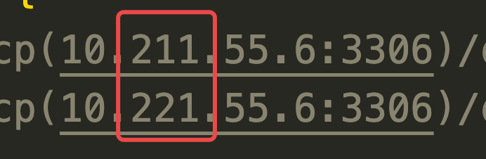
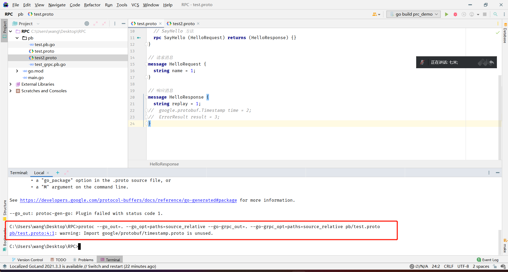
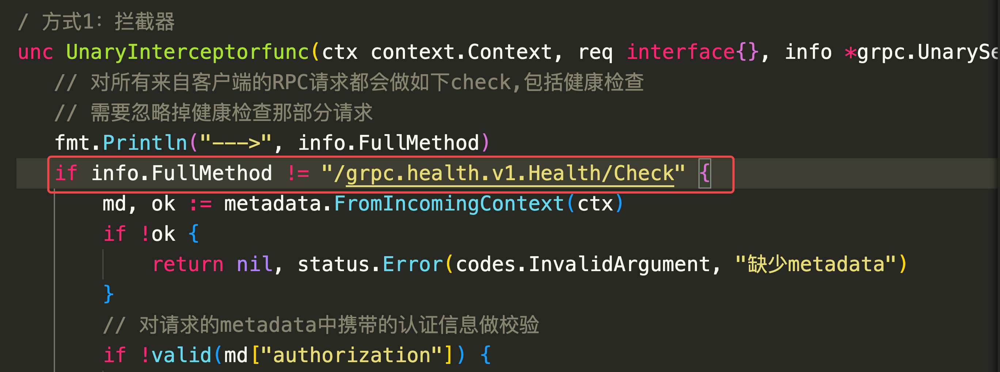
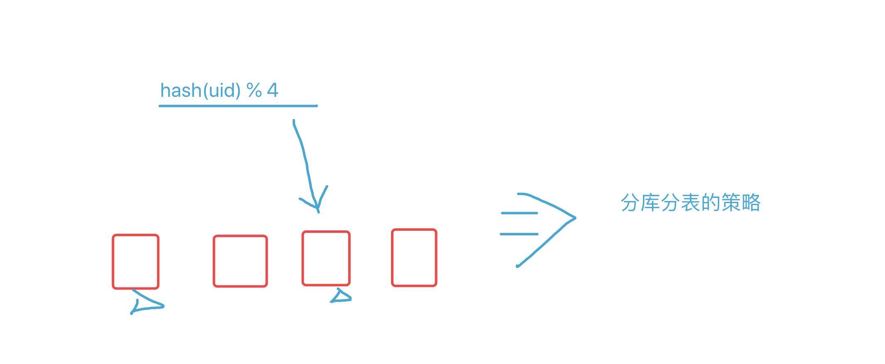
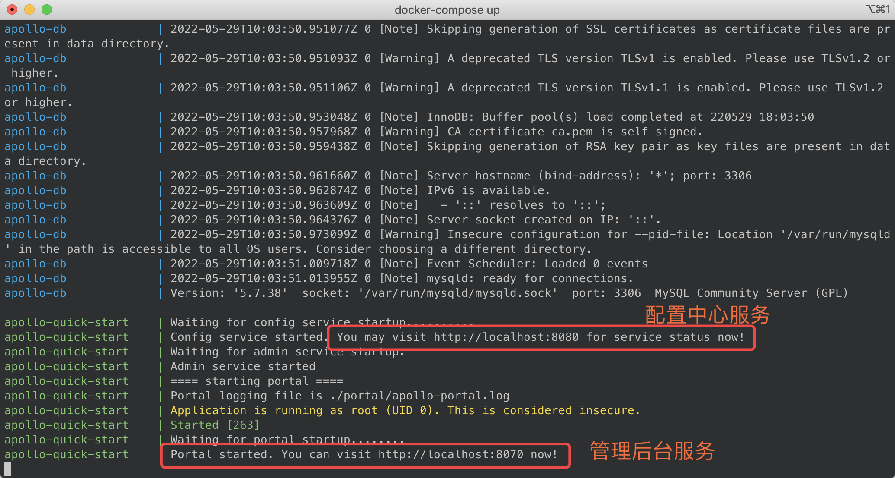

# day18课上笔记（21人）


## 课前答疑

1. 程康华提的问题

   1. 说 一个星期啦我都没连上MySQL，不能没有老师。

   2. 具体是：使用Viper读取配置，连接MySQL超时。

      最终发现是配置文件IP写错了

      

      还是得沉下心来，仔仔细细，不能浮躁。

2. 王文建的问题

   

   一定要自己学会看报错信息。

3. flag包传的命令行参数，怎么给非main包调用，网上都是在main包的例子

​	main包定义的全局变量只能在main包中使用。

​	如果需要在别的包中使用的话，可以通过传参的方式把main包中的变量传给对方。


4. 如何import 导入 自己本地的其他`.proto`文件

   .
   ├── go.mod
   ├── go.sum
   ├── main.go
   └── proto
       ├── add.pb.go
       ├── add.proto
       ├── add_grpc.pb.go
       ├── test.proto
       ├── test2.pb.go
       └── test2.proto

​	`add.proto`中import `test2.proto`中定义的*ErrorResult*

注意的问题：

​	1. 两个`.proto`文件的`option go_package = "add_server/proto;proto";` 要一致


方法1：在项目目录下编译`proto/`目录下的`.proto`文件：

```bash
protoc --proto_path=. --go_out=. --go_opt=paths=source_relative --go-grpc_out=. --go-grpc_opt=paths=source_relative proto/test2.proto proto/add.proto
```


方法2：

直接进入项目目录下的proto/目录下,编译当前目录下的所有文件

```bash
protoc --proto_path=. --go_out=. --go_opt=paths=source_relative --go-grpc_out=. --go-grpc_opt=paths=source_relative *.proto
```


## 内容回顾


### gRPC进阶

1. 普通RPC和流式RPC（共四种模式）
2. metadata (元数据)，保存的是一些类似 HTTP请求中header中的数据。
3. 加密 TLS
4. 错误处理
   1. codes :`import "google.golang.org/grpc/codes"` 列举常用的状态码
   2. status :`import "google.golang.org/grpc/internal/status"` ：status和error之间的转换
5. 拦截器 （类似于中间件）
   1. 客户端拦截器和服务端拦截器
   2. 普通拦截器和流式拦截器

### consul

1. consul是什么？
   1. 高可用、一致性
   2. 怎么去实现高可用
   3. raft
2. 实现注册中心
   1. 为什么要使用注册中心
   2. 服务注册
   3. 服务发现
   4. 常用的注册中心 eureka、zookeeper、etcd、consul、nacos

3. consul的优势

   1. 自带管理界面
   2. 带健康检查
   3. 社区比较友好

4. consul的API

   1. 服务注册、服务发现、服务注销

5. Go语言Agent操作consul

   1.  服务注册、服务发现、服务注销

   

面试三连：不会、没用过、不知道


作业：

参照海棠的代码

客户端可以实现一个自定义的认证类型

```go
// JWTAuth 自定义认证类型
type JWTAuth struct {
	token string
}

// GetRequestMetadata 实现grpc/credentials.PerRPCCredentials接口
func (t JWTAuth) GetRequestMetadata(ctx context.Context, in ...string) (map[string]string, error) {
	return map[string]string{
		"authorization": "Bearer " + t.token,
	}, nil
}

// RequireTransportSecurity 实现grpc/credentials.PerRPCCredentials接口
func (JWTAuth) RequireTransportSecurity() bool {
	return false
}
```

在grpc.Dial 建联接的时候可以指定使用认证

```go
conn, err := grpc.Dial(
  "192.168.1.11:50052",
  grpc.WithTransportCredentials(insecure.NewCredentials()),
  grpc.WithPerRPCCredentials(JWTAuth{token: "some-secret-token"}),
)
```


## 今日内容

### consul注销服务

1. 如何注销服务
2. 注销服务的时间点！

### 健康检查

1. 为什么要做健康检查

   1. 保证服务正常可用

2. gRPC服务怎么配置健康检查 => 本质上就是注册中心每隔一段时间请求你的服务1次

   1. gRPC服务本身要支持健康检查

      ```go
      healthServer := health.NewServer()
      healthpb.RegisterHealthServer(s, healthServer) // 注册健康检查的服务
      ```

   2. consul要能支持定期的发出健康检查的请求

      向consul注册服务的时候，指定check方法

      ```go
      // RegisterService 将服务注册到consul
      func (c *consul) RegisterService() error {
      	check := &api.AgentServiceCheck{
      		GRPC:                           "192.168.1.1:8999",  // 这里一定要写外网地址
      		Timeout:                        "10s",  // 超时
      		Interval:                       "10s",  // 每隔10秒做一次健康检查
      		DeregisterCriticalServiceAfter: "20s",  // 注销不健康的服务
      	}
      	address := viper.GetString("grpc_service.address")
      	port := viper.GetInt("grpc_service.port")
      	// 在向consul注册服务的时候告诉consul
      	// 你每隔10s请求一下我的健康检查服务吧
      	srv := &api.AgentServiceRegistration{
      		ID:      "hello-127.0.0.1-8999",
      		Name:    "hello",
      		Tags:    []string{"GuangZhou", "hello", "joil"},
      		Address: address,
      		Port:    port,
      		Check:   check,
      	}
      	return c.consul.Agent().ServiceRegister(srv)
      }
      ```

容易出问题的两个地方：

1. consul健康检查那里要写外网IP

2. 如果server端配置了拦截器，需要注意豁免健康检查的请求

   

   

**补充**让程序自己查询自己的出口IP

```go
// GetOutboundIP 获取本机的出口IP
func GetOutboundIP() (net.IP, error) {
	conn, err := net.Dial("udp", "8.8.8.8:80")
	if err != nil {
		return nil, err
	}
	defer conn.Close()
	localAddr := conn.LocalAddr().(*net.UDPAddr)
	return localAddr.IP, nil
}
```

### grpc负载均衡

1. 负载均衡（load balance）是什么？
   1. 保障服务的均衡及可用性

2. 常见的负载均衡算法
   1. 轮训
   2. 加权轮训
   3. 。。。



gRPC原生支持的负载均衡策略

	1. pick_first
	1. round_robin

###  apollo配置中心介绍和使用

1. 配置中心是什么？ 不能硬编码到代码里的一些数据信息
2. 为什么要用配置中心？


3. 主流的配置中心
   1. apollo 推荐用这个！ 比较成熟
   2. nacos 

Apollo 官方文档：https://www.apolloconfig.com/#/zh/design/apollo-design

博客:https://www.liwenzhou.com/posts/Go/apollo/




微服务框架：自己写pb，生成代码

go-zero/katros v2/go-kit/  go-micro/dubbo-go


## 本周作业

1. 课上的代码示例自己动手写一遍

2. apollo自己回去搭一下，看下文档熟悉界面。


