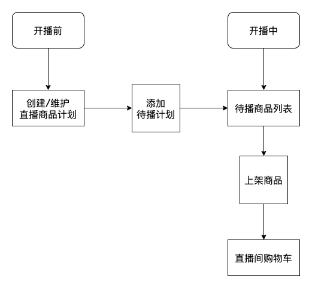

# 直播电商

直播带货光宗耀祖。——罗永浩


## 业务介绍


## 业务流程



商家/主播 开启直播  --> 在直播中控台 添加商品 --> 设置秒杀 --> 配置秒杀时间  --> 配置各SKU的秒杀价格、库存、限购数量

开始秒杀 --> 用户点击购买 --> 跳转到电商提单页。（直播只要进入商详页就属于电商范畴了。）


目前直播带货：

1. 宣传为主  

   1. 事先按顺序挂好商品
   1. 直播按顺序讲解宣传

2. 限量秒杀（福利价）

   1. 直播时添加福利商品修改库存（电商通过mq通知到直播）


直播端点击购物篮 拉取商品列表

热门直播间还有提前预热 将商品列表写入redis

## 功能拆分

### 商品微服务

1. 商品列表
2. 直播间商品列表
3. 商品详情

### 库存服务

1. 设置库存
2. 扣减库存

### 订单服务

1. 创建订单
   1. 查询商品服务获取价格等信息
   2. 调用库存服务执行库存扣减
   3. 调用订单服务创建订单详情


## 项目内容

### 整体学习目标

1. 搞清楚直播带货的业务流程  --> 分析产品能力（提升技术之外的能力）
2. go语言微服务开发的能力（基于gRPC）--> 多写代码，理解基于gRPC的微服务开发 --> 使用社区里的微服务框架（kratos）
3. 项目没有成品，真正的企业级项目都是很复杂的。

### day19（17人）

1. 直播带货业务介绍

   1. 为什么直播带货会流行？ --》 产品
   2. 直播带货的技术架构
      1. 直播
         1. 推拉流，
            1. 推流端把实时的音视频数据推送到服务端，服务端（合流、转码、录制、转推、鉴黄）
            2. 拉流 看播
            3. 连麦PK --> 实时性要求很高。
            4. 多人语音房，9连麦
            5. obs推流 --> 大型活动，专业音视频设备
         2. 技术栈：
            1. 前端：h5/ios、android  sdk
            2. 后端：C++、播放器、ffmpeg、webrtc、cdn
         3. 业务类
            1. webrtc 信令模块，任务模块
            2. im ：直播间聊天、私信等--> goim
            3. 点赞、送礼、排行榜、粉丝标签等等。。。

2. 电商业务介绍

   1. 电商很复杂
   2. 无实物、有实物、O2O、B2C等等
   3. 大型的电商架构
      1. 商品中心
         1. SPU --> 品 (iphone13)
         2. SKU --> item(iphone13 金色 128G)
         3. 类目中心
      2. 库存
         1. 单一仓库
         2. 分区仓库
      3. 商户中心
         1. 大品牌
         2. 经销商
         3. 核销
         4. 广告
      4. 订单中心
         1. 订单
         2. 购物车
      5. 支付中心
         1. 支付方式
         2. 分期支付
         3. 定金支付
         4. 混合支付
         5. 货到付款
      6. 物流中心
         1. 寄快递
         2. 查快递 --> 订阅物流状态
      7. 履约中心
         1. 退货
         2. 换货
         3. 只退不换
         4. 。。。
      8. 用户中心
         1. 地址服务
         2. 收藏服务
         3. 推荐
      9. 营销中心
         1. 优惠券
         2. 满减券、立减
         3. 折扣券
         4. 专属券
         5. 平台会员、店铺会员。。。
      10. 广告推荐
      11. 发票

3. 商品微服务

   1. 表结构设计

      1. 商品表 goods
      2. 直播间商品表 room_goods
      3. 中午：
         1. 建表，建测试数据
         2. 按照表编写好对应的model

   2. pb定义

      1. 商品服务对外提供的两个方法：

         1. 小黄车：直播间商品列表
         2. 商详页：商品详情页

      2. 根据pb文件生成代码

         ```bash
         protoc --proto_path=. --go_out=. --go_opt=paths=source_relative --go-grpc_out=. --go-grpc_opt=paths=source_relative proto/goods.proto
         ```

   3. 补充Makefile

   4. 业务代码实现

      1. 代码分层
      2. GORM

   5. gRPC-Gateway --> 帮我们的gRPC服务实现一套RESTful API

      1. https://github.com/grpc-ecosystem/grpc-gateway
      2. 

安装  gRPC-gateway相关插件

```bash
go install \
    github.com/grpc-ecosystem/grpc-gateway/v2/protoc-gen-grpc-gateway \
    github.com/grpc-ecosystem/grpc-gateway/v2/protoc-gen-openapiv2
```

proto代码中添加stub

生成grpc-Gateway代码

```bash
protoc \
	--go_out=. \
	--go_opt=paths=source_relative \
	--go-grpc_out=. \
	--go-grpc_opt=paths=source_relative \
	--grpc-gateway_out=. \
	--grpc-gateway_opt paths=source_relative \
```


Makefile: https://zhuanlan.zhihu.com/p/350297509


## 课前答疑

1. 负载均衡？

   1. 借助外部的proxy、k8s，server mesh 做负载均衡。（项目的架构/部署的层面）
   2. gRPC自带的轮训实现负载均衡（课上讲过）

2. API的微服务？

   1. 基于gin框架实现的RESTful API
   2. 服务端API调用另外一个服务的API

3. protobuf如何区分设置零值和默认值？

   1. 通常要减少语义的混淆
      1. `int64 userId = 1;` 
      2. 尽量把默认零值设置成无害的。
      3. 性别：  0 1 2

   2. 自定义类型，单独加字段表示是否设置值  --> `sql.NullString`

4. 项目文档怎么写？
   1. 多看多学，没啥好办法
   2. 如果实在不会写就怎么能写清楚怎么来。
   3. 前端交互的文档
      1. 我们公司用的是yapi
         1. 前后端并行开发的时候，双方可以约定好字段类型，yapi可以提供mock接口给前端
      2. swagger +apifox (海棠推荐)
5. swagger 会讲吗
   1. 这种工具类的自己照着文档来就行。
6. sql模糊匹配
   1. %?% 尽量少用，小项目可以用。
   2. 文档检索的场景一般都用：
      1. 把需要进行文档检索的字段info写入es--> (id,info)写入es
      2. 检索文本字段 -> 主键 -> 去数据库查完整记录


## 今日分享

代码还是要多写。

算法和数据结构怎么学：

	1. 网上找大学里面老师讲的算法和数据结构网课，就当是科普了，坚持看两遍。
	1. 坚持做题，leetcode、牛客网
	1. 算法和语言没关系。
	1. 提前准备，作为长线的任务坚持学。
