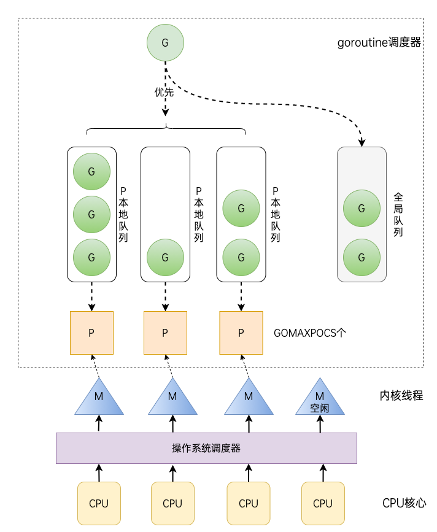

# day08课上笔记（25人）


## 内容回顾

### Go并发

#### 理论基础

串行、并行、并发的区别

进程、线程、协程、gorotuine

#### goroutine

```bash
go f()
```

1. 启动goroutine很简单，难点在怎么样把并发的任务封装成一个函数`f`。

2. goroutine对应的函数执行完，该goroutine就退出了。

3. Go语言一定有一个main goroutine执行main函数。

4. 主程序一旦退出，程序里面启动的goroutine都退出。（夜王和异鬼）

5. 线上的程序一般都是常驻内存运行的，所以要注意防止goroutine泄露。 --> goroutine对应的函数不按预期退出。

GMP模型



#### channel

channel 本质上还是一个结构体（一种特殊的类型），看起来像是一个管道。

channel的声明

```go
var ch chan string
ch == nil  // 通道的零值nil
```

channel的初始化

```go
ch = make(chan string, 1)
```

无缓冲区的通道和有缓冲区的通道

无缓冲区的通道：快递必须要当面签收 ；接力棒必须要手把手传递

```go
func f1(ch1 chan int){
  time.Sleep(10*time.Second)
  ch1 <- 10 // 没有缓冲区，没有人接收，代码执行不下去，一直阻塞在这里
  ch1 <- 100
  ch1 <- 200
  fmt.Println("王文建")
}
```

```go
func main(){
  ch1 := make(chan int)  // 无缓冲的channel
  go f1(ch1)
  v := <- ch1  // 在main goroutine有人接收值
  fmt.Println(v)
  v2 := <- ch1
  fmt.Println(v2)
}
```

有缓冲区的通道：有快递柜

通道操作

1. 发送：`ch <- 10`
2. 接收：`v := <- ch` ; `v, ok := <- ch`，ok表示通道中是否还有值
3. 关闭：`close`,一个通道只能关闭1次；通常是由发送方执行关闭；通道不是必须关闭的；通道会被垃圾回收掉


通道本质上就是一个特殊的结构体，它主要用来协调goroutine的运行，是goroutine之间通信的工具。

go语言的并发是建立在goroutine和channel基础上的。

CSP并发模型：用通信来实现共享内存。

#### 单向通道

只能执行发送或者只能执行接收的通道。

什么时候用单向通道？

- 限制别人对通道使用的时候要用单向通道。--> 我们把通道作为返回值返回的时候。

```go
var ch1 <- chan int
var ch2 chan<- int
```


#### select

可以同时从多个通道操作

```go
select{
  case ch1<-:
  
  case <-ch2:
  
  default:
}
```

空select

没人条件满足，会阻塞

```go
select{
  
}
```


作业讲解


海棠代码


## 今日内容

### 互斥锁

### sync


#### sync.Once

应用的两个条件：

1. 存在多goroutine并发操作 2. 某个操作只想被执行一次


确保一个函数在并发的场景下只执行一次。

只有一个方法:`Do(func())`


#### sync.Map

Go内置的 map 不是并发安全的

应用场景：

当一个map变量或者结构体里面的一个map类型的字段 可能会被多个goroutine访问的时候

方法1：自己加锁

方法2：sync.Map

```bash
concurrent map writes
```


### 网络编程

https://www.liwenzhou.com/posts/Go/15_socket/


互联网协议理论基础


### 单元测试

https://www.liwenzhou.com/posts/Go/unit-test/


#### 格式要求

1. 测试文件的名字 ： `xx_test.go`
2. 测试函数的名字：`TestXxx(t *testing.T)`


#### 基准测试


## 本周作业


1. 编写一个回文检测函数，并为其编写单元测试和基准测试，根据测试的结果逐步对其进行优化。（回文：一个字符串正序和逆序一样，如“Madam,I’mAdam”、“油灯少灯油”等。）
2. 把goroutine和channel的作业题好好写一下
3. 上课写的例子自己写一下
4. 下节课讲数据库，自己提前预习下https://www.liwenzhou.com/posts/Go/go_mysql/，自己装备好mysql和redis环境。

